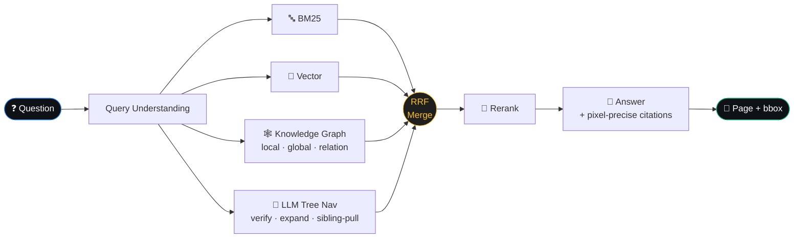
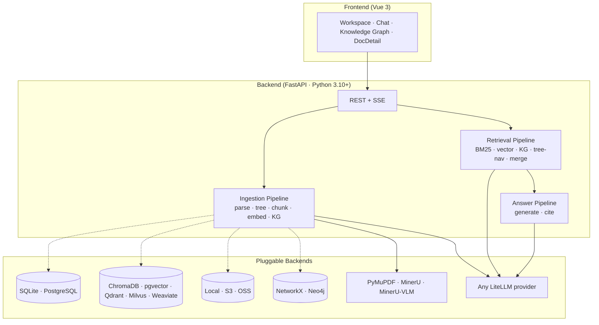

<p align="center">
  
</p>

<h3 align="center">RAG that thinks like a domain expert.</h3>

<p align="center">
  Most RAG retrieves chunks. ForgeRAG <strong>navigates document trees</strong>, <strong>traverses knowledge graphs</strong>, and <strong>cites the exact pixels</strong> behind every claim.
</p>

<p align="center">
  <a href="https://github.com/deeplethe/ForgeRAG/releases"></a>
  <a href="LICENSE"></a>
  <a href="https://github.com/deeplethe/ForgeRAG/stargazers"></a>
  <a href="https://github.com/deeplethe/ForgeRAG/issues"></a>
  <a href="https://discord.gg/XJadJHvxdQ"></a>
</p>

<p align="center">
  <a href="#-quick-start">Quick Start</a> ·
  <a href="#-why-forgerag">Why</a> ·
  <a href="#-how-it-works">How</a> ·
  <a href="#-benchmark">Benchmark</a> ·
  <a href="docs/">Docs</a> ·
  <a href="./README_CN.md">中文</a>
</p>

---

## ✨ Why ForgeRAG

Existing RAG systems each fail in their own way:

| Approach | Strength | Where it breaks |
|---|---|---|
| **Naive embedding** RAG | Fast semantic search | Similarity ≠ relevance — misses exact matches and section context |
| **GraphRAG** (Microsoft) | Cross-doc entity links | Concept skeleton without source-text grounding |
| **LightRAG** (HKUDS) | Dual-level graph retrieval | Answers synthesized from KG summaries — high hallucination risk |
| **PageIndex** | Tree reasoning, single-doc accuracy | Latency scales linearly with doc count — not production |

**ForgeRAG fuses all four**: BM25 + vector for fast pre-filter, LLM tree navigation for structural reasoning, knowledge graph for multi-hop, RRF fusion for the merge — every claim grounded back to a **page + bbox** the user can click and verify.

---

## 🧠 How it works



**Two reasoning lanes**, fused. BM25 + vector handles the fast 80% (literal + semantic recall). The KG + tree-nav lanes handle the hard 20% — multi-hop questions like _"Which suppliers of Apple also supply Samsung?"_ — by traversing entity-relation neighborhoods (KG) and verifying section relevance via LLM-driven tree walks (PageIndex-style, but reused over a tree the LLM only builds **once at ingestion**, not per query).

A retrieval trace UI shows every path's contribution per query — see what BM25 caught, what the KG added, what the rerank dropped.

---

## 📸 What you get

> **Screenshots:** see [`docs/SCREENSHOTS.md`](docs/SCREENSHOTS.md) for the current set. Drop new ones into `docs/screenshots/` to refresh — no other file changes needed.

| | |
|---|---|
| **Workspace** | File-manager UX with drag-and-drop, recycle bin, Windows-style restore. Live ingestion status per file (parsing → embedding → building graph). |
| **Chat** | Streaming answers with `[c_N]` citations. Click any citation → opens the source PDF at the exact bbox. |
| **Document Detail** | 3-pane: tree navigator + PDF viewer + chunks/KG-mini. Hover a chunk → highlights its source region. |
| **Knowledge Graph** | Sigma-rendered force-directed view. Filter by document, search entities, click an edge to see the supporting chunk. |

---

## 🚀 Quick Start

```bash
git clone https://github.com/deeplethe/ForgeRAG.git
cd ForgeRAG

python -m venv .venv && source .venv/bin/activate   # Windows: .venv\Scripts\activate
pip install -r requirements.txt
cd web && npm install && npm run build && cd ..

python scripts/setup.py    # interactive wizard: backends + LLM keys + auto-pip
python main.py             # http://localhost:8000
```

The setup wizard is bilingual (EN/中文), checkpointed (Ctrl+C resumable), and **only installs the backend deps your config picks** — don't memorize pip names per database.

> **Docker?**
> ```bash
> cp .env.example .env  &&  $EDITOR .env       # set passwords + LLM key
> docker compose up -d                          # postgres + neo4j + opencraig
> open http://localhost:8000                    # → register the first admin
> ```
> The first registered account is auto-promoted to admin. See
> [docs/deployment.md](docs/deployment.md) for backup, upgrade, and TLS notes.

> **Tip:** Enable [MinerU](https://github.com/opendatalab/MinerU) in the web Settings panel for a step-change in PDF parsing quality on tables, formulas, and complex layouts.

---

## 📊 Benchmark

[UltraDomain](https://github.com/HKUDS/LightRAG) methodology · LLM-as-judge pairwise · win % shown as **ForgeRAG / LightRAG**:

| Domain | Comprehensiveness | Diversity | Empowerment | **Overall** |
|---|:---:|:---:|:---:|:---:|
| Agriculture | **58.6** / 41.4 | 47.1 / **52.9** | **52.9** / 47.1 | **56.4** / 43.6 |
| Computer Science | **55.6** / 44.4 | 48.4 / **51.6** | **54.0** / 46.0 | **54.8** / 45.2 |
| Legal | **57.0** / 43.0 | 46.5 / **53.5** | **53.5** / 46.5 | **55.6** / 44.4 |
| Mix | **56.3** / 43.7 | 47.8 / **52.2** | **54.3** / 45.7 | **55.1** / 44.9 |

<sub>Judge: qwen3-max · Reproduce: [`scripts/compare_bench.py`](scripts/compare_bench.py) · ForgeRAG additionally provides verifiable `[c_N]` citations the benchmark doesn't score for.</sub>

🚧 _More benchmarks (vs RAGFlow, GraphRAG, vanilla RAG, on more domains and metrics) in progress._

---

## 🏗️ Built on



Every component is a config swap — pick your stack at the wizard, change later by editing `forgerag.yaml` and re-running `setup.py --sync-deps`.

---

## ⚙️ Highlights

- **🎯 Pixel-precise citations** — every `[c_N]` carries `doc_id + page + bbox`; click highlights in PDF viewer
- **🛤️ Full retrieval trace** — see which path scored what, what got expanded, what got rerank-dropped
- **🧱 Tree-aware chunking** — chunk boundaries respect document structure (chapters, sections, tables/figures isolated)
- **🌐 Knowledge graph w/ embeddings** — entity name embeddings for cross-lingual fuzzy match; relation-description embeddings for relation-semantic search
- **🔁 RRF fusion** — Reciprocal Rank Fusion merges 4 retrieval paths; sibling/descendant/cross-ref expansion before rerank
- **🎛️ Per-request overrides** — `QueryOverrides` on `POST /query` toggles paths, top-ks, rerank — great for A/B and SDK
- **🗑️ Recycle bin + Undo** — soft-delete, Windows-style restore (rebuilds missing parent folders), 30-day auto-purge
- **⚡ SQLite single-process · PG multi-process** — startup checks prevent foot-guns; clamps workers automatically
- **🌍 Multi-format** — PDF, DOCX, PPTX, HTML, Markdown, TXT, plus images (PNG/JPG/WEBP/GIF/BMP/TIFF) and spreadsheets (XLSX/CSV/TSV) as native one-block-per-page documents — VLM describes each image, LLM describes each sheet, descriptions feed retrieval and KG just like text chunks

---

## 🗂️ Project Layout

```
ForgeRAG/
├── api/             FastAPI routes + Pydantic schemas
├── answering/       Answer + citation pipeline
├── ingestion/       Parse → tree → chunk → embed → KG
├── parser/          PDF parsing, chunking, tree building
├── retrieval/       BM25 / vector / KG / tree-nav / RRF merge
├── embedder/        Embedding backends (LiteLLM, sentence-transformers)
├── graph/           KG stores (NetworkX, Neo4j)
├── persistence/     Relational + vector + blob layer
├── config/          Pydantic config models, YAML schema
├── web/             Vue 3 frontend
└── docs/            Architecture, configuration, API reference
```

---

## 📚 Docs

- **[Getting Started](docs/getting-started.md)** — install, first ingest, first query
- **[Architecture](docs/architecture.md)** — full ingestion + retrieval + answering walkthroughs (with diagrams)
- **[Configuration](docs/configuration.md)** — every YAML option with defaults
- **[API Reference](docs/api-reference.md)** — REST + SSE streaming
- **[Deployment](docs/deployment.md)** — Docker, production checklist, Nginx
- **[Development](docs/development.md)** — dev setup, testing, adding backends
- **[Auth](docs/auth.md)** — single-admin password + SK tokens
- **[Roadmaps](docs/roadmaps/)** — design docs for in-flight features ([retrieval evolution](docs/roadmaps/retrieval-evolution.md), [spreadsheet support](docs/roadmaps/spreadsheet-as-document.md))

---

## 🗺️ Roadmap

**Next wave — retrieval evolution** ([full design](docs/roadmaps/retrieval-evolution.md)):

- [x] **Unified `/search`** — retrieval primitive exposed standalone, no LLM. Chunks default, files rollup opt-in. Shipped.
- [ ] **Web search** — Tavily / Brave / Bing through `/search` via `include=["web"]`. Untrusted-content + prompt-injection defense lands here so every later layer inherits it.
- [ ] **Multi-user + folder permissions** — email/password auth, per-folder `(owner, shared_with)` model, `path_filters: list[str]` as authz primitive. **Multi-user, not multi-tenant** — shared global tree, shared indices.
- [ ] **Agentic search** — multi-step retrieval driven by LLM tool calls (`search_local` / `web_search` / `fetch_url` / `read_chunk`). Bounded by iteration / token / time / web-call budgets.
- [ ] 🚀 **Public release** — at this point: differentiator (AS) live, multi-user ready, web blended. Ship.
- [ ] **Deep research with HITL** — Plan → parallel per-section AS → draft → synthesis. Three HITL modes; `checkpoint` is default (review each section before research moves on). Export Markdown / PDF.
- [ ] **Retrieval MCP** — expose `search / query / agentic_search / research_*` as MCP tools. Lands last so the tool list is the full surface in one shot.

**Foundation work** (in parallel as needed):

- [ ] Comprehensive benchmark suite (vs RAGFlow / GraphRAG / vanilla, additional domains)
- [ ] Scale to 1M+ documents — incremental indexing, async KG, sharded vector store
- [ ] Multi-language retrieval — cross-lingual query/document support
- [ ] Python SDK (`pip install forgerag-sdk`)
- [ ] Config panel diagnostics (missing-provider warnings, validation feedback)

---

## 📈 Star history

<a href="https://star-history.com/#deeplethe/ForgeRAG&Date">
  <picture>
    <source media="(prefers-color-scheme: dark)" srcset="https://api.star-history.com/svg?repos=deeplethe/ForgeRAG&type=Date&theme=dark" />
    
  </picture>
</a>

---

## 🤝 Contributing

Bug reports, features, and docs improvements all welcome. See [CONTRIBUTING.md](CONTRIBUTING.md). Stop by [Discord](https://discord.gg/XJadJHvxdQ) for design discussions.

## 🔗 Related work

- [LightRAG](https://github.com/HKUDS/LightRAG) — graph-based RAG with dual-level retrieval
- [GraphRAG](https://github.com/microsoft/graphrag) — Microsoft's graph-powered RAG with community summaries
- [PageIndex](https://github.com/VectifyAI/PageIndex) — reasoning-based vectorless retrieval
- [MinerU](https://github.com/opendatalab/MinerU) — document parsing engine ForgeRAG uses for rich layouts

## License

OpenCraig is released under the [GNU Affero General Public License v3.0](LICENSE)
(AGPLv3) for community use and self-hosted deployment.

**Commercial licensing** is available for organizations that need to deploy
OpenCraig without AGPLv3 obligations — for example, embedding into a
proprietary product, or running a closed-source managed service. Contact
[info@deeplethe.com](mailto:info@deeplethe.com) for terms.

> Versions tagged before the AGPL switch were released under the MIT License;
> that grant remains valid for those earlier versions. The original MIT text
> is preserved at [`LICENSE.MIT-historical`](LICENSE.MIT-historical) for
> reference. See [`RELICENSING.md`](RELICENSING.md) for details.
