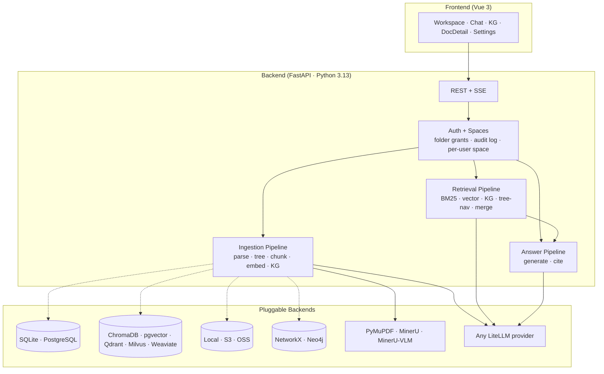

<p align="center">
  
</p>

<h3 align="center">Every claim has a coordinate.</h3>

<p align="center">
  Self-hosted document intelligence for the people who can't afford to misquote. Every answer cites the page + bounding box it came from — on your servers, your LLM keys, your data.
</p>

<p align="center">
  <a href="https://github.com/opencraig/opencraig/releases"></a>
  <a href="LICENSE"></a>
  <a href="https://github.com/opencraig/opencraig/stargazers"></a>
  <a href="https://github.com/opencraig/opencraig/issues"></a>
  <a href="https://discord.gg/XJadJHvxdQ"></a>
</p>

<p align="center">
  <a href="#-quick-start">Quick Start</a> ·
  <a href="#-who-its-for">Who it's for</a> ·
  <a href="#-how-it-works">How</a> ·
  <a href="#-benchmark">Benchmark</a> ·
  <a href="docs/">Docs</a> ·
  <a href="./README_CN.md">中文</a>
</p>

---

## ✨ Why OpenCraig

| You're using | Good for | Where OpenCraig differs |
|---|---|---|
| **ChatGPT / Claude with PDF uploads** | Casual one-off Q&A on a few files | Persistent multi-document workspace, multi-user, knowledge graph, runs on your servers |
| **Notion AI / Mendable** | SaaS-first teams who don't mind cloud | Your corpus stays local; pixel-precise citations; KG retrieval; no SaaS subscription |
| **Glean** | Big-co enterprise search | Glean is five-figures-USD/year + needs an enterprise admin team; OpenCraig serves a department, a lab, or a single professional |
| **AnythingLLM** | OSS self-host RAG | The closest peer — OpenCraig goes deeper on KG/tree retrieval, citation precision, and folder-grant multi-user |
| **Hand-rolled embedding RAG** | "We have a Python team" | Skip 6 months of work: KG extraction, tree retrieval, citation pipeline, multi-user authz, recycle bin, audit log, setup wizard — already shipped |

> Compared to **GraphRAG (Microsoft)** — OpenCraig productises the multi-hop KG idea (parallel KG retrieval lane fused via RRF) instead of leaving it as a research library. Tree retrieval is influenced by **PageIndex** but reuses a tree built once at ingest, not per query.

---

## 🎯 Who it's for

OpenCraig is built for **knowledge-dense small teams that can't or won't put their corpus on a SaaS**:

- **Patent agents / IP boutiques** — long technical specs, prior art, citation accuracy is a legal asset
- **Small law firms / litigation teams** — privileged documents, case law, internal precedent
- **Biotech / pharma R&D departments** — HIPAA-adjacent compliance, literature, internal protocols
- **Independent analysts / financial research desks** — IPO prospectuses, regulatory filings, alpha hides in cross-document detail
- **University labs / research centers** — student researcher onboarding, paper libraries, internal datasets
- **Independent professionals running an LLC or 个体工作室** — when "your data on your laptop / your VPS" is the whole point

It's **not** built for: customer-support chatbots, public knowledge bases, marketing-content generation, casual ChatPDF use.

---

## 🧠 How it works


**Two reasoning lanes**, fused. BM25 + vector handles the fast 80% (literal + semantic recall). The KG + tree-nav lanes handle the hard 20% — multi-hop questions like _"Which suppliers of Apple also supply Samsung?"_ — by traversing entity-relation neighborhoods (KG) and verifying section relevance via LLM-driven tree walks (PageIndex-style, but reused over a tree the LLM only builds **once at ingestion**, not per query).

A retrieval trace UI shows every path's contribution per query — see what BM25 caught, what the KG added, what the rerank dropped.

---

## 📸 What you get

> **Screenshots:** see [`docs/SCREENSHOTS.md`](docs/SCREENSHOTS.md) for the current set.

| | |
|---|---|
| **Workspace** | File-manager UX with drag-drop, recycle bin, folder Members invite-and-share. Each user has a personal Space at `/users/<username>` displayed as their `/`; admins also see the global tree. Live ingestion status per file (parsing → embedding → building graph). |
| **Chat** | Streaming answers with `[c_N]` citations. Click any citation → opens the source PDF at the exact bbox. Citations carry across follow-up turns. |
| **Document Detail** | 3-pane: tree navigator + PDF viewer + chunks/KG-mini. Hover a chunk → highlights its source region. |
| **Knowledge Graph** | Sigma-rendered force-directed view. Filter by document, search entities, click an edge to see the supporting chunk. |
| **Activity log** (admin) | Every folder / document / share / role mutation, with the actor's identity stamped in. Filter by user, action category, time range. |
| **Setup wizard** | One-key model-platform presets (SiliconFlow / OpenAI / DeepSeek / Anthropic / Ollama). New deploy → web UI → pick a tile → done. No yaml editing. |

---

## 🚀 Quick Start

The **fastest path** is docker compose:

```bash
git clone https://github.com/opencraig/opencraig.git
cd opencraig
cp .env.example .env  &&  $EDITOR .env       # set passwords (LLM key optional — wizard collects it)
docker compose up -d                          # postgres + neo4j + opencraig
```

Then open <http://localhost:8000>:

1. **Pick a model platform** in the wizard (SiliconFlow recommended for China / cost-sensitive deploys; Ollama for fully air-gapped).
2. **Register** the first account — it's auto-promoted to admin.
3. **Drop in a PDF** and ask a question. The first ingest takes a minute; afterwards retrieval is sub-second.

### Bare-metal install

```bash
python -m venv .venv && source .venv/bin/activate   # Windows: .venv\Scripts\activate
pip install -r requirements.txt
cd web && npm install && npm run build && cd ..

python scripts/setup.py                              # CLI wizard alternative to the web one
python main.py                                        # http://localhost:8000
```

The CLI wizard is bilingual (EN/中文), checkpointed (Ctrl+C resumable), and **only installs the backend deps your config picks** — don't memorize pip names per database.

> **Tip:** Enable [MinerU](https://github.com/opendatalab/MinerU) in the Settings panel for a step-change in PDF parsing quality on tables, formulas, and complex layouts.

---

## 🏗️ Built on



Every component is a config swap — pick your stack at the wizard, change later by editing `docker/config.yaml`.

---

## ⚙️ Highlights

- **🎯 Pixel-precise citations** — every `[c_N]` carries `doc_id + page + bbox`; click highlights in PDF viewer
- **👥 Multi-user (NOT multi-tenant)** — one shared workspace, folder-level grants. Each user has a personal Space; admins manage. Path-as-authz primitive plumbed through every retrieval call
- **🪪 Folder Members UI** — right-click any folder → invite teammates by email, set view/edit role, see inherited members from parent
- **📜 Activity log** — every folder / document / share / role mutation surfaces in `/settings/audit` with actor + filter + pagination
- **🔌 One-key model platforms** — SiliconFlow / OpenAI / DeepSeek / Anthropic / Ollama presets in the first-boot wizard. One API key → chat + embedding + reranker
- **🛤️ Full retrieval trace** — see which path scored what, what got expanded, what got rerank-dropped
- **🧱 Tree-aware chunking** — chunk boundaries respect document structure (chapters, sections, tables/figures isolated)
- **🌐 Knowledge graph w/ embeddings** — entity name embeddings for cross-lingual fuzzy match; relation-description embeddings for relation-semantic search
- **🔁 RRF fusion** — Reciprocal Rank Fusion merges 4 retrieval paths; sibling/descendant/cross-ref expansion before rerank
- **🗑️ Recycle bin + Undo** — soft-delete, Windows-style restore (rebuilds missing parent folders), 30-day auto-purge
- **⚡ SQLite single-process · PG multi-process** — startup checks prevent foot-guns; clamps workers automatically
- **🌍 Multi-format** — PDF, DOCX, PPTX, HTML, Markdown, TXT, plus images (PNG/JPG/WEBP/GIF/BMP/TIFF) and spreadsheets (XLSX/CSV/TSV) as native one-block-per-page documents
- **🔒 No phone home** — zero telemetry, zero analytics, zero error reporting back to OpenCraig itself. See [`PRIVACY.md`](PRIVACY.md)

---

## 📊 Benchmark

[UltraDomain](https://github.com/HKUDS/LightRAG) methodology · LLM-as-judge pairwise · win % shown as **OpenCraig / LightRAG**:

| Domain | Comprehensiveness | Diversity | Empowerment | **Overall** |
|---|:---:|:---:|:---:|:---:|
| Agriculture | **58.6** / 41.4 | 47.1 / **52.9** | **52.9** / 47.1 | **56.4** / 43.6 |
| Computer Science | **55.6** / 44.4 | 48.4 / **51.6** | **54.0** / 46.0 | **54.8** / 45.2 |
| Legal | **57.0** / 43.0 | 46.5 / **53.5** | **53.5** / 46.5 | **55.6** / 44.4 |
| Mix | **56.3** / 43.7 | 47.8 / **52.2** | **54.3** / 45.7 | **55.1** / 44.9 |

<sub>Judge: qwen3-max · Reproduce: [`scripts/compare_bench.py`](scripts/compare_bench.py) · OpenCraig additionally provides verifiable `[c_N]` citations the benchmark doesn't score for.</sub>

🚧 _More benchmarks (vs RAGFlow, GraphRAG, vanilla RAG, on more domains and metrics) in progress._

---

## 🗂️ Project Layout

```
OpenCraig/
├── api/                 FastAPI routes, auth middleware, setup wizard
│   ├── auth/             AuthMiddleware, PathRemap, FolderShareService
│   ├── routes/           One file per resource
│   └── setup_presets.py  SiliconFlow / OpenAI / Ollama / ... presets
├── answering/           Answer + citation pipeline
├── ingestion/           Parse → tree → chunk → embed → KG
├── parser/              PDF parsing, chunking, tree building
├── retrieval/           BM25 / vector / KG / tree-nav / RRF merge
├── embedder/            Embedding backends (LiteLLM, sentence-transformers)
├── graph/               KG stores (NetworkX, Neo4j)
├── persistence/         Relational + vector + blob + folder service + share service
├── config/              Pydantic config models, YAML loader (with overlay merge)
├── web/src/             Vue 3 frontend (Workspace, Chat, KG, Settings, Setup wizard)
├── docs/operations/     Backup / restore / upgrading runbooks
├── docs/roadmaps/       In-flight feature design docs (per-user spaces, etc.)
└── scripts/             backup.sh, restore.sh, setup.py, batch_ingest.py
```

---

## 📚 Docs

- **[Getting Started](docs/getting-started.md)** — install, first ingest, first query
- **[Architecture](docs/architecture.md)** — full ingestion + retrieval + answering walkthroughs (with diagrams)
- **[Configuration](docs/configuration.md)** — every YAML option with defaults
- **[API Reference](docs/api-reference.md)** — REST + SSE streaming
- **[Deployment](docs/deployment.md)** — Docker, production checklist, Nginx
- **[Backup & Restore](docs/operations/backup.md)** — RTO/RPO, schedule, cross-version recovery
- **[Upgrading](docs/operations/upgrading.md)** — alembic flow, pinning, rollback
- **[Auth](docs/auth.md)** — multi-user, folder grants, OAuth-proxy mode
- **[Privacy](PRIVACY.md)** — what data leaves your network (spoiler: only LLM API calls you configure)
- **[Roadmaps](docs/roadmaps/)** — design docs for in-flight features

---

## 🗺️ Roadmap

### Shipped

- [x] **Pixel-precise citations** — `doc_id + page + bbox` on every claim
- [x] **Tree retrieval** + **KG retrieval** + **RRF fusion**
- [x] **Multi-user, folder grants, per-user Spaces** (path-as-authz, no multi-tenant)
- [x] **Folder Members UI** — invite teammates, set view/edit role
- [x] **Audit log** — admin-visible activity feed of every mutation
- [x] **First-boot setup wizard** — one-key model platform presets (SiliconFlow / OpenAI / etc.)
- [x] **One-shot docker compose** — postgres + neo4j + opencraig with healthchecks
- [x] **Backup + restore scripts** with cross-version recovery notes
- [x] **AGPL v3 + commercial dual license**

### Next

- [ ] **Group / Team abstraction** — invite groups instead of users; on-demand based on first big customer's org chart
- [ ] **SCIM provisioning** — Okta / Azure AD auto-sync for enterprise tier
- [ ] **Web search** — Tavily / Brave / Bing through `/search` via `include=["web"]`. Untrusted-content + prompt-injection defense lands here so every later layer inherits it
- [ ] **Agentic search** — multi-step retrieval driven by LLM tool calls (`search_local` / `web_search` / `fetch_url` / `read_chunk`)
- [ ] **Deep research with HITL** — Plan → parallel per-section AS → draft → synthesis. Three HITL modes
- [ ] **Retrieval MCP** — expose `search / query / agentic_search / research_*` as MCP tools
- [ ] **Comprehensive benchmark suite** vs RAGFlow / GraphRAG / vanilla on more domains

### Foundation work (in parallel)

- [ ] Scale to 1M+ documents — incremental indexing, async KG, sharded vector store
- [ ] Python SDK (`pip install opencraig-sdk`)
- [ ] More connectors —飞书 / 企业微信 / 钉钉 / SharePoint / Google Drive ingestion

---

## 📈 Star history

<a href="https://star-history.com/#opencraig/opencraig&Date">
  <picture>
    <source media="(prefers-color-scheme: dark)" srcset="https://api.star-history.com/svg?repos=opencraig/opencraig&type=Date&theme=dark" />
    
  </picture>
</a>

---

## 🤝 Contributing

Bug reports, features, and docs improvements all welcome. See [CONTRIBUTING.md](CONTRIBUTING.md). Stop by [Discord](https://discord.gg/XJadJHvxdQ) for design discussions.

PRs require accepting the [CLA](RELICENSING.md#future-contributions) so the project retains the right to issue commercial licenses derived from the codebase. The core stays AGPLv3 — that doesn't change.

## 🔗 Related work

- [LightRAG](https://github.com/HKUDS/LightRAG) — graph-based RAG with dual-level retrieval
- [GraphRAG](https://github.com/microsoft/graphrag) — Microsoft's graph-powered RAG with community summaries
- [PageIndex](https://github.com/VectifyAI/PageIndex) — reasoning-based vectorless retrieval
- [MinerU](https://github.com/opendatalab/MinerU) — document parsing engine OpenCraig uses for rich layouts
- [AnythingLLM](https://github.com/Mintplex-Labs/anything-llm) — closest commercial-OSS peer in the self-host RAG space

## License

OpenCraig is released under the [GNU Affero General Public License v3.0](LICENSE)
(AGPLv3) for community use and self-hosted deployment.

**Commercial licensing** is available for organizations that need to deploy
OpenCraig without AGPLv3 obligations — for example, embedding into a
proprietary product, or running a closed-source managed service. Contact
[info@deeplethe.com](mailto:info@deeplethe.com) for terms.

> Versions tagged before the AGPL switch were released under the MIT License;
> that grant remains valid for those earlier versions. The original MIT text
> is preserved at [`LICENSE.MIT-historical`](LICENSE.MIT-historical) for
> reference. See [`RELICENSING.md`](RELICENSING.md) for details.
