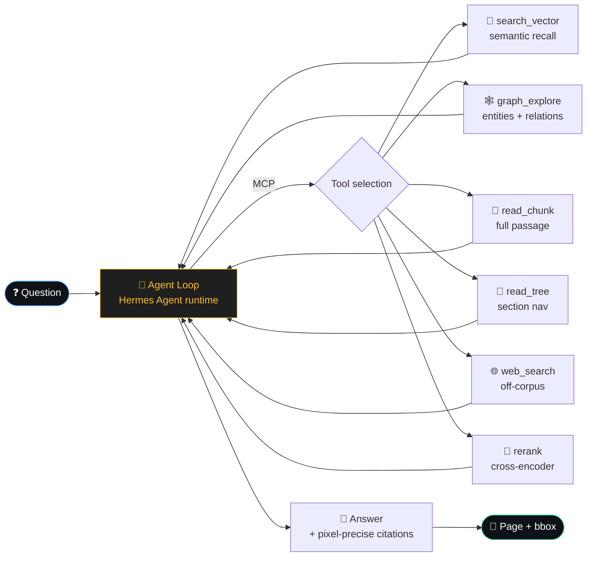
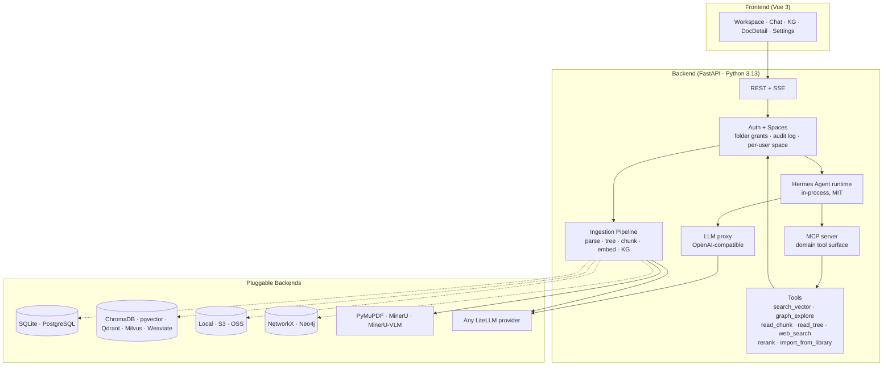

<p align="center">
  
</p>

<h1 align="center">OpenCraig</h1>
<h3 align="center">Permission-Aware Knowledge Context for Enterprise Agents</h3>

<p align="center">
  The knowledge backend your agents plug into. Path-scoped retrieval enforces your team's existing folder permissions on every search, KG walk, and citation — so an agent that calls our MCP tools can only see what its authenticated user can see. Self-hosted, MCP-native, multi-user from day one.
</p>

<p align="center">
  <a href="https://github.com/opencraig/opencraig/releases"></a>
  <a href="LICENSE"></a>
  <a href="https://github.com/opencraig/opencraig/stargazers"></a>
  <a href="https://github.com/opencraig/opencraig/issues"></a>
  <a href="https://discord.gg/XJadJHvxdQ"></a>
</p>

<p align="center">
  <a href="#-quick-start">Quick Start</a> ·
  <a href="#-who-its-for">Who it's for</a> ·
  <a href="#-how-it-works">How</a> ·
  <a href="#-editions">Editions</a> ·
  <a href="docs/">Docs</a> ·
  <a href="./README_CN.md">中文</a>
</p>

---

> ## 📦 v1.0.0 is the final OSS release
>
> This is the last open-source version of OpenCraig under AGPLv3. Future
> development continues as **OpenCraig Enterprise (v3.0+)** — a separate
> commercial product covering lineage, audit, promote-to-library,
> auditable team workflows, and managed sandbox execution. See
> [Editions](#-editions) below for what's where.
>
> The OSS edition (this repo) is **feature-complete and free to self-
> host indefinitely**. Security patches are accepted via GitHub issues
> for **12 months** post-release (until 2027-05-09); after that, the
> repo is archived. PRs are not accepted post-tag.
>
> Brief: knowledge management + agentic search with structured
> citations. Multi-user, folder-grant authz, BYOK LLM. Production-
> grade enough to run a small team's research workflow today.

---

## ✨ Why OpenCraig

OpenCraig is positioned as **the knowledge / context layer for enterprise agent runtimes**, not as a chat product. The differentiation is at the seams between three things existing tools usually have only one of: **multi-user permission topology**, **MCP-native tool surface**, and **structured retrieval with bbox-precise citations**.

| You're using | What it gives you | What it doesn't |
|---|---|---|
| **Claude Code / Cursor / Cline alone** | Mature agent runtime + great built-in tools | Single-user; no team knowledge backend; no permission scoping when reading shared docs |
| **Hermes Agent / OpenClaw alone** | Self-hostable agent runtime, MIT-licensed | Same as above — runtime without a team-shared knowledge layer |
| **Notion AI / Glean / Mendable** | Polished search UX, SaaS-managed | Closed source; not MCP; agents can't plug in; corpus on someone else's servers |
| **AnythingLLM / RAGFlow / GraphRAG** | OSS self-host RAG | Single-user (or shallow multi-user); no permission-scoped retrieval; not exposed as MCP tools that respect per-user authz |
| **LangChain / LlamaIndex** | Building blocks | A library, not a knowledge backend. You'd need to build everything OpenCraig already shipped (folder authz, KG visibility, ingestion pipeline, MCP server) |
| **Hand-rolled embedding RAG** | "We have a Python team" | Skip 6 months of plumbing: path-as-authz, KG extraction with visibility-aware filtering, structured chunking, MCP wrappers, multi-user permission UI |

**The OpenCraig category is "permission-aware knowledge context for agents":**

- **Path-as-authz** — folder grants are the only authorization primitive; every retrieval call resolves the principal's accessible-folder set BEFORE running the search (prefilter on vector / BM25 / tree-nav) and AFTER materialising KG entities (postfilter — entities whose source-doc set isn't fully covered by the user's grants are dropped, no description redaction)
- **MCP-native** — `/api/v1/mcp` exposes search / KG / library tools to any compatible agent runtime (Hermes today, Claude Code / Cursor / Cline tomorrow). Per-connection auth scopes the ToolContext to the right user.
- **Structured retrieval, not text blob** — chunks know their bbox, tree position, source page; KG entities know their source chunks; citations open the PDF at the exact rectangle.

---

## 🎯 Who it's for

OpenCraig is built for **knowledge-dense small teams that can't or won't put their corpus on a SaaS**:

- **Patent agents / IP boutiques** — long technical specs, prior art, citation accuracy is a legal asset
- **Small law firms / litigation teams** — privileged documents, case law, internal precedent
- **Biotech / pharma R&D departments** — HIPAA-adjacent compliance, literature, internal protocols
- **Independent analysts / financial research desks** — IPO prospectuses, regulatory filings, alpha hides in cross-document detail
- **University labs / research centers** — student researcher onboarding, paper libraries, internal datasets
- **Independent professionals running an LLC or 个体工作室** — when "your data on your laptop / your VPS" is the whole point

It's **not** built for: customer-support chatbots, public knowledge bases, marketing-content generation, casual ChatPDF use.

---

## 🧠 How it works



**Agentic retrieval, not a fixed pipeline.** The agent (Hermes
Agent runtime, in-process) decides per-question which tools to call
and in which order. For "what does section 3.2 say" it might just
read_tree + read_chunk; for "how does X relate to Y across the
corpus" it leads with graph_explore. Multi-hop questions chain
several tools across iterations.

Each tool enforces multi-user authz at the dispatch boundary — the
search hits the agent sees are already scoped to the user's
accessible folders. KG visibility is stricter: entities whose source
docs aren't fully covered by the user's grants are dropped (no
description redaction fallback because LLM context can't render a
visibility banner).

A retrieval trace UI shows every tool call live — what the agent
asked, what came back, how long it took. Click a citation `[c_N]`
in the answer → opens the source PDF at the exact bbox.

---

## 📸 What you get

> **Screenshots:** see [`docs/SCREENSHOTS.md`](docs/SCREENSHOTS.md) for the current set.

| | |
|---|---|
| **Workspace** | File-manager UX with drag-drop, recycle bin, folder Members invite-and-share. Each user has a personal Space at `/users/<username>` displayed as their `/`; admins also see the global tree. Live ingestion status per file (parsing → embedding → building graph). |
| **Chat** | Streaming answers with `[c_N]` citations. Click any citation → opens the source PDF at the exact bbox. Citations carry across follow-up turns. |
| **Document Detail** | 3-pane: tree navigator + PDF viewer + chunks/KG-mini. Hover a chunk → highlights its source region. |
| **Knowledge Graph** | Sigma-rendered force-directed view. Filter by document, search entities, click an edge to see the supporting chunk. |
| **Activity log** (admin) | Every folder / document / share / role mutation, with the actor's identity stamped in. Filter by user, action category, time range. |
| **Setup wizard** | One-key model-platform presets (SiliconFlow / OpenAI / DeepSeek / Anthropic / Ollama). New deploy → web UI → pick a tile → done. No yaml editing. |

---

## 🚀 Quick Start

The **fastest path** is docker compose:

```bash
git clone https://github.com/opencraig/opencraig.git
cd opencraig
cp .env.example .env  &&  $EDITOR .env       # set passwords (LLM key optional — wizard collects it)
docker compose up -d                          # postgres + neo4j + opencraig
```

Then open <http://localhost:8000>:

1. **Pick a model platform** in the wizard (SiliconFlow recommended for China / cost-sensitive deploys; Ollama for fully air-gapped).
2. **Register** the first account — it's auto-promoted to admin.
3. **Drop in a PDF** and ask a question. The first ingest takes a minute; afterwards retrieval is sub-second.

### Bare-metal install

```bash
python -m venv .venv && source .venv/bin/activate   # Windows: .venv\Scripts\activate
pip install -r requirements.txt
cd web && npm install && npm run build && cd ..

python scripts/setup.py                              # CLI wizard alternative to the web one
python main.py                                        # http://localhost:8000
```

The CLI wizard is bilingual (EN/中文), checkpointed (Ctrl+C resumable), and **only installs the backend deps your config picks** — don't memorize pip names per database.

> **Tip:** Enable [MinerU](https://github.com/opendatalab/MinerU) in the Settings panel for a step-change in PDF parsing quality on tables, formulas, and complex layouts.

---

## 🏗️ Built on



The agent runtime is [Hermes Agent](https://github.com/NousResearch/hermes-agent)
(NousResearch, MIT) running in-process with built-in filesystem
tools hard-disabled — its tool surface is exclusively what
OpenCraig exposes via MCP. This was the final architectural choice
made before the OSS cut: the agent loop itself isn't where the
differentiation lives, the **tools are** (multi-user authz +
structured retrieval + KG + bbox citations).

Every component is a config swap — pick your stack at the wizard, change later by editing `docker/config.yaml`.

---

## ⚙️ Highlights

- **🎯 Pixel-precise citations** — every `[c_N]` carries `doc_id + page + bbox`; click highlights in PDF viewer
- **👥 Multi-user (NOT multi-tenant)** — one shared workspace, folder-level grants. Each user has a personal Space; admins manage. Path-as-authz primitive plumbed through every retrieval call
- **🪪 Folder Members UI** — right-click any folder → invite teammates by email, set view/edit role, see inherited members from parent
- **📜 Activity log** — every folder / document / share / role mutation surfaces in `/settings/audit` with actor + filter + pagination
- **🔌 One-key model platforms** — SiliconFlow / OpenAI / DeepSeek / Anthropic / Ollama presets in the first-boot wizard. One API key → chat + embedding + reranker
- **🤖 Agentic retrieval** — Hermes Agent runtime picks tools per question instead of running a fixed pipeline; trace UI shows every tool call live
- **🔌 MCP tool surface** — domain tools (search / KG / read_chunk / etc.) exposed at `/api/v1/mcp` for any compatible agent runtime
- **🧱 Tree-aware chunking** — chunk boundaries respect document structure (chapters, sections, tables/figures isolated)
- **🌐 Knowledge graph w/ embeddings** — entity name embeddings for cross-lingual fuzzy match; relation-description embeddings for relation-semantic search
- **🗑️ Recycle bin + Undo** — soft-delete, Windows-style restore (rebuilds missing parent folders), 30-day auto-purge
- **⚡ SQLite single-process · PG multi-process** — startup checks prevent foot-guns; clamps workers automatically
- **🌍 Multi-format** — PDF, DOCX, PPTX, HTML, Markdown, TXT, plus images (PNG/JPG/WEBP/GIF/BMP/TIFF) and spreadsheets (XLSX/CSV/TSV) as native one-block-per-page documents
- **🔒 No phone home** — zero telemetry, zero analytics, zero error reporting back to OpenCraig itself. See [`PRIVACY.md`](PRIVACY.md)

---

## 📊 Benchmark

[UltraDomain](https://github.com/HKUDS/LightRAG) methodology · LLM-as-judge pairwise · win % shown as **OpenCraig / LightRAG**:

| Domain | Comprehensiveness | Diversity | Empowerment | **Overall** |
|---|:---:|:---:|:---:|:---:|
| Agriculture | **58.6** / 41.4 | 47.1 / **52.9** | **52.9** / 47.1 | **56.4** / 43.6 |
| Computer Science | **55.6** / 44.4 | 48.4 / **51.6** | **54.0** / 46.0 | **54.8** / 45.2 |
| Legal | **57.0** / 43.0 | 46.5 / **53.5** | **53.5** / 46.5 | **55.6** / 44.4 |
| Mix | **56.3** / 43.7 | 47.8 / **52.2** | **54.3** / 45.7 | **55.1** / 44.9 |

<sub>Judge: qwen3-max · Reproduce: [`scripts/compare_bench.py`](scripts/compare_bench.py) · OpenCraig additionally provides verifiable `[c_N]` citations the benchmark doesn't score for.</sub>

🚧 _More benchmarks (vs RAGFlow, GraphRAG, vanilla RAG, on more domains and metrics) in progress._

---

## 🗂️ Project Layout

```
OpenCraig/
├── api/                 FastAPI routes, auth middleware, setup wizard
│   ├── auth/             AuthMiddleware, PathRemap, FolderShareService
│   ├── routes/           One file per resource
│   └── setup_presets.py  SiliconFlow / OpenAI / Ollama / ... presets
├── answering/           Answer + citation pipeline
├── ingestion/           Parse → tree → chunk → embed → KG
├── parser/              PDF parsing, chunking, tree building
├── retrieval/           BM25 / vector / KG / tree-nav / RRF merge
├── embedder/            Embedding backends (LiteLLM, sentence-transformers)
├── graph/               KG stores (NetworkX, Neo4j)
├── persistence/         Relational + vector + blob + folder service + share service
├── config/              Pydantic config models, YAML loader (with overlay merge)
├── web/src/             Vue 3 frontend (Workspace, Chat, KG, Settings, Setup wizard)
├── docs/operations/     Backup / restore / upgrading runbooks
├── docs/roadmaps/       In-flight feature design docs (per-user spaces, etc.)
└── scripts/             backup.sh, restore.sh, setup.py, batch_ingest.py
```

---

## 📚 Docs

- **[Getting Started](docs/getting-started.md)** — install, first ingest, first query
- **[Architecture](docs/architecture.md)** — full ingestion + retrieval + answering walkthroughs (with diagrams)
- **[Configuration](docs/configuration.md)** — every YAML option with defaults
- **[API Reference](docs/api-reference.md)** — REST + SSE streaming
- **[Deployment](docs/deployment.md)** — Docker, production checklist, Nginx
- **[Backup & Restore](docs/operations/backup.md)** — RTO/RPO, schedule, cross-version recovery
- **[Upgrading](docs/operations/upgrading.md)** — alembic flow, pinning, rollback
- **[Auth](docs/auth.md)** — multi-user, folder grants, OAuth-proxy mode
- **[Privacy](PRIVACY.md)** — what data leaves your network (spoiler: only LLM API calls you configure)
- **[Roadmaps](docs/roadmaps/)** — design docs for in-flight features

---

## 🗺️ What's in v1.0.0 (and what's not)

### Shipped in OSS (this repo, frozen)

- [x] **Pixel-precise citations** — `doc_id + page + bbox` on every claim
- [x] **Structured retrieval tools** — vector / KG / tree-nav / read_chunk / rerank
- [x] **Agentic retrieval** — Hermes Agent runtime in-process; multi-step tool selection per question
- [x] **MCP tool surface** — `/api/v1/mcp` exposes domain tools to any MCP client
- [x] **OpenAI-compatible LLM proxy** — `/api/v1/llm/v1/chat/completions` via litellm router
- [x] **Web search tool** — Tavily / Brave / Bing with prompt-injection defenses
- [x] **Multi-user, folder grants, per-user Spaces** — path-as-authz, no multi-tenant
- [x] **Folder Members UI** — invite teammates, set view/edit role
- [x] **Audit log** — admin-visible activity feed of every mutation
- [x] **First-boot setup wizard** — one-key model platform presets
- [x] **One-shot docker compose** — postgres + neo4j + opencraig with healthchecks
- [x] **Backup + restore scripts** with cross-version recovery notes
- [x] **AGPL v3 + commercial dual license**

### Reserved for OpenCraig Enterprise (v3.0+, see [Editions](#-editions))

These were intentionally **not** shipped in OSS — the differentiation
lives here, and they need a commercial product behind them:

- **Lineage backbone** — every artifact tracks its source docs +
  agent run + actor, end-to-end queryable
- **Promote-to-Library** — agent outputs ⇄ Library: knowledge
  compounds across runs
- **Audit UI** — "what did the agent do with this folder?" reverse
  query; "this doc influenced which artifacts?"
- **Sandboxed code execution** — Hermes runs in a per-user
  container with bash / edit / grep tools enabled; backend
  orchestrates lifecycle + lineage attribution
- **Workspace folder model** — folder-as-project (Claude-Code-style)
  with per-folder agent runtime + cwd scoping
- **Skills as auditable team workflows** — codified, versioned,
  team-shared agent procedures with full provenance
- **SSO / SCIM** — Okta / Azure AD provisioning, group-based authz
- **Hardened sandbox** — non-root, no-net default, capability drop
- **Managed hosting + SLA** for teams that don't want to ops it

### Not coming back to OSS

The post-v1.0 OSS repo accepts security patches only (until
2027-05-09). No new features, no architectural changes, no PRs
for new functionality. Forks are encouraged under AGPLv3 if you
want to build on this baseline.

---

## 🎁 Editions

| | **OpenCraig OSS v1.0.0** (this repo) | **OpenCraig Enterprise v3.0+** |
|---|---|---|
| License | AGPLv3 | Commercial, contact for terms |
| Source | Open, this repo | Closed |
| Self-host | ✅ Free, indefinitely | ✅ Available |
| Managed hosting | ❌ | ✅ |
| Multi-user + folder authz | ✅ | ✅ |
| Agentic retrieval | ✅ | ✅ + sandboxed code execution |
| Lineage / audit / promote-to-library | ❌ | ✅ |
| Skills (team workflows) | ❌ | ✅ |
| SSO / SCIM | ❌ | ✅ |
| Support | GitHub issues, security patches 12mo | SLA, dedicated support |
| Roadmap | Frozen at v1.0.0 | Active development |

Inquiries about Enterprise: [opencraig.dev/enterprise](https://opencraig.dev/enterprise) (or open a GitHub discussion until that page exists).

---

## 📈 Star history

<a href="https://star-history.com/#opencraig/opencraig&Date">
  <picture>
    <source media="(prefers-color-scheme: dark)" srcset="https://api.star-history.com/svg?repos=opencraig/opencraig&type=Date&theme=dark" />
    
  </picture>
</a>

---

## 🤝 Contributing

**v1.0.0 is the final OSS release** — feature PRs are not accepted post-tag. What we still take:

- **Security reports** via GitHub issues (private vulnerability disclosure preferred — see SECURITY.md). Patches accepted through **2027-05-09**.
- **Documentation fixes** — typos, broken links, clarification PRs are welcome on existing docs through the maintenance window.
- **Translations** — community translations of the README / setup wizard prompts.

For everything else (new features, architectural changes, large refactors), please **fork freely under AGPLv3** — that's exactly what the license is for. The Enterprise edition ships separately and isn't accepting external contributions either.

Past contributors who signed the [CLA](RELICENSING.md#future-contributions) are listed in CONTRIBUTORS.md. The core stays AGPLv3.

## 🔗 Related work

- [LightRAG](https://github.com/HKUDS/LightRAG) — graph-based RAG with dual-level retrieval
- [GraphRAG](https://github.com/microsoft/graphrag) — Microsoft's graph-powered RAG with community summaries
- [PageIndex](https://github.com/VectifyAI/PageIndex) — reasoning-based vectorless retrieval
- [MinerU](https://github.com/opendatalab/MinerU) — document parsing engine OpenCraig uses for rich layouts
- [AnythingLLM](https://github.com/Mintplex-Labs/anything-llm) — closest commercial-OSS peer in the self-host RAG space

## License

OpenCraig is released under the [GNU Affero General Public License v3.0](LICENSE)
(AGPLv3) for community use and self-hosted deployment.

**Commercial licensing** is available for organizations that need to deploy
OpenCraig without AGPLv3 obligations — for example, embedding into a
proprietary product, or running a closed-source managed service. Contact
[info@deeplethe.com](mailto:info@deeplethe.com) for terms.

> Versions tagged before the AGPL switch were released under the MIT License;
> that grant remains valid for those earlier versions. The original MIT text
> is preserved at [`LICENSE.MIT-historical`](LICENSE.MIT-historical) for
> reference. See [`RELICENSING.md`](RELICENSING.md) for details.
