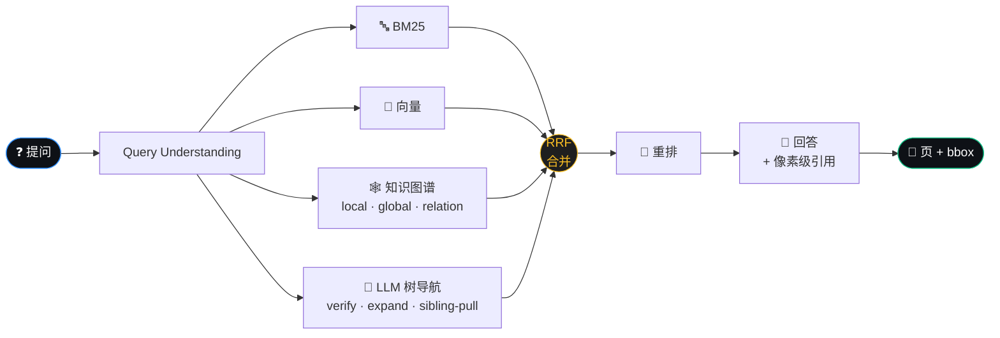
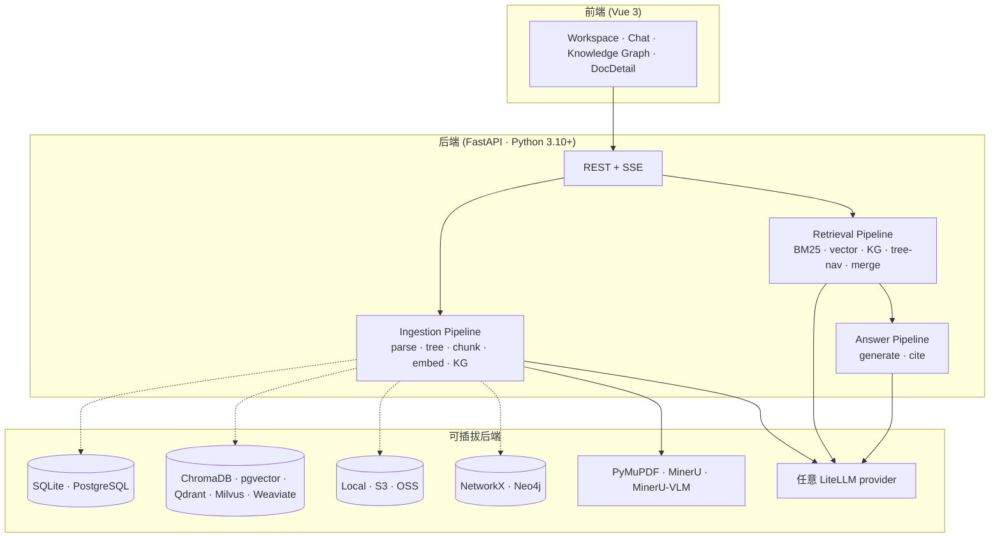

<p align="center">
  
</p>

<h3 align="center">像领域专家那样思考的 RAG。</h3>

<p align="center">
  多数 RAG 只是检索片段。ForgeRAG <strong>导航文档树</strong>、<strong>遍历知识图谱</strong>、并把<strong>每一个论断都精确到像素级溯源</strong>。
</p>

<p align="center">
  <a href="https://github.com/deeplethe/ForgeRAG/releases"></a>
  <a href="LICENSE"></a>
  <a href="https://github.com/deeplethe/ForgeRAG/stargazers"></a>
  <a href="https://github.com/deeplethe/ForgeRAG/issues"></a>
  <a href="https://discord.gg/XJadJHvxdQ"></a>
</p>

<p align="center">
  <a href="#-快速开始">快速开始</a> ·
  <a href="#-为什么">为什么</a> ·
  <a href="#-工作原理">原理</a> ·
  <a href="#-基准测试">基准</a> ·
  <a href="docs/">文档</a> ·
  <a href="./README.md">English</a>
</p>

---

## ✨ 为什么

现有 RAG 各有各的不足：

| 方案 | 优点 | 失效之处 |
|---|---|---|
| **朴素 embedding** RAG | 语义召回快 | 相似 ≠ 相关；漏精确匹配和章节上下文 |
| **GraphRAG**（微软） | 跨文档实体打通 | 只有概念骨架、缺原文锚定 |
| **LightRAG**（HKUDS） | 双层图检索 | 答案靠 KG 摘要合成、幻觉风险高 |
| **PageIndex** | 树推理、单文档准确率高 | 延迟随文档数线性增长，不能上生产 |

**ForgeRAG 把四条路融合**：BM25 + 向量做毫秒级粗排、LLM 树导航做结构推理、知识图谱做多跳推断、RRF 融合做合并 —— 每一句话最终都能 click 跳到 **页 + bbox** 校验。

---

## 🧠 工作原理



**两条推理路并行**。BM25 + 向量打 80% 简单 case（字面 + 语义召回）；KG + 树导航处理 20% 难 case —— 多跳问题如 _"苹果的供应商里哪些也供 Samsung？"_，靠 KG 邻域遍历 + LLM 树状结构验证（PageIndex 的思路，但树**只在入库时建一次**，不在每次查询时重建）。

UI 提供完整的 retrieval trace，可看到每条路在每次查询里贡献了什么、被合并/重排丢弃了什么。

---

## 📸 你能得到什么

> **截图：** 见 [`docs/SCREENSHOTS.md`](docs/SCREENSHOTS.md)。新截图丢进 `docs/screenshots/` 即可，无需改其他文件。

| | |
|---|---|
| **工作区** | 文件管理体验，拖拽、回收站、Windows 式还原。每个文件实时显示 ingest 阶段（parsing → embedding → building graph）。 |
| **对话** | 流式回答、`[c_N]` 引用。点引用 → PDF 自动跳到对应 bbox 高亮。 |
| **文档详情** | 三栏：树导航 + PDF 预览 + chunks/KG-mini。chunk 悬停 → 高亮原文区域。 |
| **知识图谱** | Sigma 渲染力导向布局。按文档过滤、搜索实体、点边查支撑 chunk。 |

---

## 🚀 快速开始

```bash
git clone https://github.com/deeplethe/ForgeRAG.git
cd ForgeRAG

python -m venv .venv && source .venv/bin/activate   # Windows: .venv\Scripts\activate
pip install -r requirements.txt
cd web && npm install && npm run build && cd ..

python scripts/setup.py    # 交互式向导：后端 + LLM keys + 自动 pip
python main.py             # http://localhost:8000
```

向导双语（EN / 中文）、可断点续跑（Ctrl+C 后下次接着来），**只装你 yaml 选中的后端依赖**——不用记每种数据库的 pip 名字。

> **Docker？** `python scripts/docker_setup.py && docker compose up -d` —— PostgreSQL + pgvector + ForgeRAG，一行命令。

> **建议：** 在 web Settings 面板启用 [MinerU](https://github.com/opendatalab/MinerU)，复杂表格 / 公式 / 排版的 PDF 解析质量大幅提升。

---

## 📊 基准测试

[UltraDomain](https://github.com/HKUDS/LightRAG) 方法论 · LLM-as-judge 两两对比 · 胜率为 **ForgeRAG / LightRAG**：

| 领域 | Comprehensiveness | Diversity | Empowerment | **总分** |
|---|:---:|:---:|:---:|:---:|
| Agriculture | **58.6** / 41.4 | 47.1 / **52.9** | **52.9** / 47.1 | **56.4** / 43.6 |
| Computer Science | **55.6** / 44.4 | 48.4 / **51.6** | **54.0** / 46.0 | **54.8** / 45.2 |
| Legal | **57.0** / 43.0 | 46.5 / **53.5** | **53.5** / 46.5 | **55.6** / 44.4 |
| Mix | **56.3** / 43.7 | 47.8 / **52.2** | **54.3** / 45.7 | **55.1** / 44.9 |

<sub>裁判：qwen3-max · 复现：[`scripts/compare_bench.py`](scripts/compare_bench.py) · ForgeRAG 还另外提供基准没考核的可验证 `[c_N]` 引用。</sub>

🚧 _更全面的基准（vs RAGFlow / GraphRAG / vanilla，更多领域和指标）进行中。_

---

## 🏗️ 技术栈



每个组件都是 config 切换 —— 向导里挑一套，事后改 `forgerag.yaml` 后跑 `setup.py --sync-deps` 同步依赖。

---

## ⚙️ 亮点

- **🎯 像素级引用** —— 每个 `[c_N]` 都带 `doc_id + page + bbox`；点击 PDF 自动高亮
- **🛤️ 完整检索追踪** —— 看每条路的得分、扩展、被 rerank 丢弃的来源
- **🧱 树感知 chunking** —— chunk 边界尊重文档结构（章/节、表/图独立切分）
- **🌐 KG 带 embedding** —— 实体名 embedding 做跨语言模糊匹配；关系描述 embedding 做关系语义检索
- **🔁 RRF 融合** —— Reciprocal Rank Fusion 合并 4 条路；rerank 前做 sibling/descendant/cross-ref 扩展
- **🎛️ 单查询级 override** —— `QueryOverrides` 切换路径、top-k、rerank —— A/B 和 SDK 友好
- **🗑️ 回收站 + Undo** —— 软删，Windows 式恢复（缺失父目录会重建），30 天自动彻底清理
- **⚡ SQLite 单进程 · PG 多进程** —— 启动检查防止脚枪；自动 clamp workers
- **🌍 多格式** —— PDF / DOCX / PPTX / XLSX / HTML / Markdown / TXT，以及图片（PNG/JPG/WEBP/GIF/BMP/TIFF）作为一类原生单块文档 —— VLM 给图片生成描述，描述跟文本 chunk 一样进入检索和 KG

---

## 🗂️ 仓库布局

```
ForgeRAG/
├── api/             FastAPI 路由 + Pydantic schemas
├── answering/       回答 + 引用管线
├── ingestion/       Parse → tree → chunk → embed → KG
├── parser/          PDF 解析 / chunking / 树构建
├── retrieval/       BM25 / 向量 / KG / 树导航 / RRF 合并
├── embedder/        Embedding 后端（LiteLLM, sentence-transformers）
├── graph/           KG 存储（NetworkX, Neo4j）
├── persistence/     关系/向量/blob 层
├── config/          Pydantic config models, YAML schema
├── web/             Vue 3 前端
└── docs/            架构、配置、API 文档
```

---

## 📚 文档

- **[快速开始](docs/getting-started.md)** —— 安装 / 首次入库 / 首次查询
- **[架构](docs/architecture.md)** —— 完整的 ingestion + retrieval + answering 走查（带图）
- **[配置](docs/configuration.md)** —— 每一项 YAML 配置与默认值
- **[API 参考](docs/api-reference.md)** —— REST + SSE 流
- **[部署](docs/deployment.md)** —— Docker、生产 checklist、Nginx
- **[开发](docs/development.md)** —— 开发环境、测试、扩后端
- **[认证](docs/auth.md)** —— 单管理员密码 + SK tokens

---

## 🗺️ Roadmap

- [ ] 完整基准测试套件（vs RAGFlow / GraphRAG / 朴素 RAG，更多领域）
- [ ] 扩到 1M+ 文档 —— 增量索引、异步 KG、向量分片
- [ ] 多语言检索 —— 跨语言查询/文档支持
- [ ] Python SDK（`pip install forgerag-sdk`）
- [ ] 配置面板诊断（缺 provider 警告、校验反馈）
- [ ] 性能：更快入库、查询缓存、异步 embedding

---

## 📈 Star 历史

<a href="https://star-history.com/#deeplethe/ForgeRAG&Date">
  <picture>
    <source media="(prefers-color-scheme: dark)" srcset="https://api.star-history.com/svg?repos=deeplethe/ForgeRAG&type=Date&theme=dark" />
    
  </picture>
</a>

---

## 🤝 贡献

欢迎 bug 报告、功能、文档改进。见 [CONTRIBUTING.md](CONTRIBUTING.md)。设计讨论来 [Discord](https://discord.gg/XJadJHvxdQ)。

## 🔗 相关项目

- [LightRAG](https://github.com/HKUDS/LightRAG) —— 双层图检索
- [GraphRAG](https://github.com/microsoft/graphrag) —— 微软的图驱动 RAG + 社区摘要
- [PageIndex](https://github.com/VectifyAI/PageIndex) —— 推理驱动的无向量检索
- [MinerU](https://github.com/opendatalab/MinerU) —— ForgeRAG 用的高质量文档解析引擎

## License

OpenCraig 采用 [GNU Affero 通用公共许可证 v3.0](LICENSE)（AGPLv3）发布，
适用于社区使用和自部署。

**商业许可**：如果你的组织需要在不受 AGPLv3 约束下使用 OpenCraig
（例如嵌入到闭源产品中，或运行闭源的托管服务），可联系
[deeplethe@gmail.com] 取得商业许可。

> AGPL 切换之前发布的版本仍按 MIT License 授权，那些版本对应的授权
> 永久有效。原始 MIT 文本保留在 [`LICENSE.MIT-historical`](LICENSE.MIT-historical)。
> 详情见 [`RELICENSING.md`](RELICENSING.md)。
