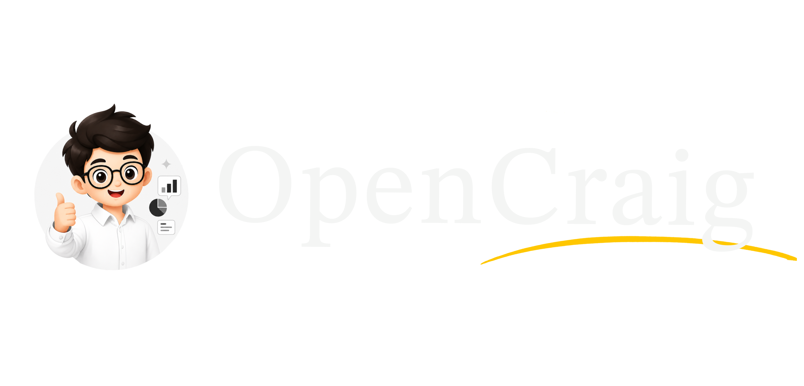
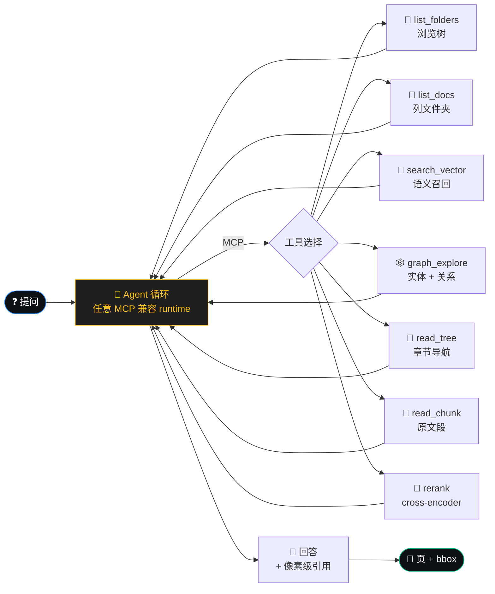
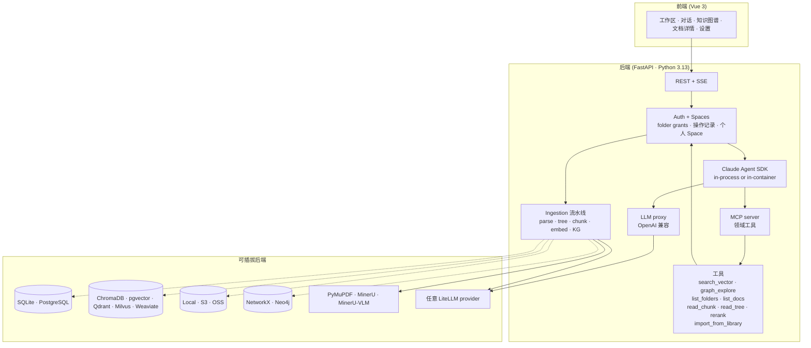

<p align="center">
  
</p>

# OpenCraig

<p align="center">
  <a href="https://github.com/opencraig/opencraig/releases"></a>
  <a href="https://github.com/opencraig/opencraig/stargazers"></a>
  <a href="https://github.com/opencraig/opencraig/issues"></a>
  <a href="https://discord.gg/XJadJHvxdQ"></a>
  <a href="LICENSE"></a>
</p>

**团队的 agentic 工作台。** 每个用户都有一个托管沙盒，agent 在沙盒里读 PDF、跑代码、写报告 —— 而不是让用户在自己机器上做这些事。检索遵循团队既有的文件夹权限，agent 只能看到所属用户有权访问的内容。

*每用户独立沙盒容器 · 权限感知检索 · MCP 原生 · BYOK · 自托管*

[快速开始](#-快速开始) · [为谁而做](#-为谁而做) · [原理](#-工作原理) · [版本](#-版本) · [文档](docs/) · [English](./README.md)

---

> ## 📦 v0.6.0 ——首个预览版
>
> OpenCraig 是**面向企业级 Agent runtime 的权限感知知识 / 上下文层**。
> v0.6.0 是 OSS 版的首个公开预览版；本仓库后续会持续开发与维护，等
> API 稳定后再切 v1.0。
>
> 同时存在的商业产品 **OpenCraig Enterprise（v3.0+）** 提供企业部署
> 专用的功能——血缘、审计、产物提升回库、可审计的团队工作流、托管沙箱
> 执行、SSO / SCIM 等。详见下文 [版本](#-版本)；**两个版本并行存活、
> 各自演进**。
>
> 简介：多用户知识管理 + 智能检索（带结构化引用）+ MCP 原生工具面。
> 文件夹级授权、BYOK LLM、完整自托管。可生产级地服务一个团队的研究
> 工作流。

---

## ✨ 为什么

OpenCraig 的定位是**企业级 Agent runtime 的知识 / 上下文层**，不是聊天产品。差异化在三件事的接缝处——大部分现有工具只占其中一个：**多用户权限拓扑**、**MCP 原生工具面**、**带 bbox 精度引用的结构化检索**。

| 你正在用 | 它给你什么 | 它没有的 |
|---|---|---|
| **Claude Code / Cursor / Cline 单独用** | 成熟的 agent runtime + 优秀的内置工具 | 单用户；没有团队知识后端；读共享文档时不做权限收敛 |
| **Claude Agent SDK 单独用** | 自托管的 agent loop（与 Claude Code 同款） | 同上——只有 runtime，没有团队知识层和沙盒基础设施 |
| **Notion AI / Glean / Mendable** | 漂亮的搜索 UX，SaaS 托管 | 闭源；不是 MCP；agent 接不进；语料在别人服务器上 |
| **AnythingLLM / RAGFlow / GraphRAG** | OSS 自托管 RAG | 单用户（或浅多用户）；没有权限收敛的检索；没有把工具 expose 成尊重每用户授权的 MCP |
| **LangChain / LlamaIndex** | 积木 | 库不是后端。OpenCraig 已发布的（文件夹授权、KG 可见性、入库流水线、MCP server）你都得自己再造 |
| **手搓 embedding RAG** | "我们有 Python 团队" | 省掉 6 个月底层工作：path-as-authz、可见性收敛的 KG 抽取、结构化切块、MCP 包装、多用户权限 UI |

**OpenCraig 的品类是"权限感知的 Agent 知识上下文层"：**

- **路径即权限** —— folder grants 是唯一的授权 primitive；每次检索调用都先把 principal 的可访问文件夹集解出（在 vector / BM25 / tree-nav **检索前** prefilter），再把 KG 实体物化（**取实体后** postfilter——source-doc 集合没被该用户授权完全覆盖的实体直接丢弃，不做"描述脱敏"降级）
- **MCP 原生** —— `/api/v1/mcp` 把搜索 / KG / library 工具暴露给任意兼容的 agent runtime（开箱内置 Claude Agent SDK；Cursor / Cline 等也走同一协议接入）。每条连接的 auth 把 ToolContext 收敛到对应用户。
- **结构化检索，不是文本团** —— chunk 知道自己的 bbox、树位置、源页；KG 实体知道自己的源 chunks；引用直接打开 PDF 到精确矩形。

---

## 🎯 为谁而做

OpenCraig 为**不能或不愿把语料放到 SaaS 上的知识密集型小团队**而做：

- **专利代理人 / IP 律所**——长技术 spec、先前技术、引用精度直接是法律资产
- **小律所 / 诉讼组**——委托人特权文档、案例、内部判例库
- **Biotech / 制药 R&D 部门**——HIPAA 邻接合规、文献、内部协议
- **独立分析师 / 卖方研究 / 私募研究台**——招股书、监管文件、alpha 来自跨文档细节
- **大学院系 / 研究中心**——研究生入门、论文库、内部数据集
- **以个体工商户 / 独资工作室名义经营的脑力工作者**——"数据在我自己电脑 / 我自己 VPS 上" 是核心诉求

它**不是**为：客服 bot、公开知识库、营销文案生成、休闲 ChatPDF 而做。

---

## 🧠 工作原理



**Agent 驱动的检索，不是固定流水线**。Claude Agent SDK（in-process 或在沙盒容器里）按问题决定调哪些工具、什么顺序。"3.2 节讲了什么"可能只调 read_tree + read_chunk；"X 和 Y 在整个语料里怎么关联"先用 graph_explore；"我们 Q3 销售有什么资料？"先 list_folders + list_docs 浏览树再决定要不要 search。多跳问题在多轮里链多个工具。

**搜索 ⇄ 浏览 ⇄ 阅读**——agent 在三种正交访问模式间挑选：

* **搜索** —— `search_vector` / `graph_explore` —— agent 已有 query，要相关段落
* **浏览** —— `list_folders` / `list_docs` —— 用户开放式提问（"我们有什么 X 资料？"），agent 应当先走树
* **阅读** —— `read_chunk` / `read_tree` —— 拉某段全文 / 看某文档大纲

每个工具在 dispatch 边界做多用户授权——agent 看到的检索结果已经被收敛到该用户可访问的文件夹下。KG 可见性更严：source docs 没被该用户授权完全覆盖的实体直接丢弃（不做"描述脱敏"降级，因为 LLM context 里渲染不了脱敏 banner）。

UI 实时显示每个工具调用——agent 问了什么、回了什么、用时多少。点回答里的 `[c_N]` 引用 → PDF 跳到精确 bbox。

---

## 📸 你能得到什么

> **截图：** 见 [`docs/SCREENSHOTS.md`](docs/SCREENSHOTS.md)。

| | |
|---|---|
| **工作区** | 文件管理体验，拖拽、回收站、文件夹 Members 邀请共享。每个用户有自己的个人 Space `/users/<username>`，在 UI 里显示为 `/`；admin 还能看到全局树。每个文件实时显示 ingest 阶段（parsing → embedding → building graph）。 |
| **对话** | 流式回答、`[c_N]` 引用。点引用 → PDF 自动跳到对应 bbox 高亮。引用在追问中保留。 |
| **文档详情** | 三栏：树导航 + PDF 预览 + chunks/KG-mini。chunk 悬停 → 高亮原文区域。 |
| **知识图谱** | Sigma 渲染力导向布局。按文档过滤、搜索实体、点边查支撑 chunk。 |
| **操作记录**（admin） | 每个文件夹 / 文档 / 共享 / 角色变更，附 actor 身份。按用户、操作类别、时间过滤。 |
| **设置向导** | 一键模型平台 preset（SiliconFlow / OpenAI / DeepSeek / Anthropic / Ollama）。新部署 → 浏览器 → 点 tile → 完成。无需改 yaml。 |

---

## 🚀 快速开始

**最快路径**是 docker compose：

```bash
git clone https://github.com/opencraig/opencraig.git
cd opencraig
cp .env.example .env  &&  $EDITOR .env       # 设置密码（LLM key 可选——向导会收集）
docker compose up -d                          # postgres + neo4j + opencraig
```

打开 <http://localhost:8000>：

1. **在向导里选模型平台**（国内 / 性价比敏感的部署推荐 SiliconFlow；完全离线推荐 Ollama）
2. **注册**第一个账号——自动 promote 成 admin
3. **拖入一份 PDF**问问题。首次入库要 1 分钟，之后检索是亚秒级

### 裸机安装

```bash
python -m venv .venv && source .venv/bin/activate   # Windows: .venv\Scripts\activate
pip install -r requirements.txt
cd web && npm install && npm run build && cd ..

python scripts/setup.py                              # 命令行向导（web 向导的另一种入口）
python main.py                                        # http://localhost:8000
```

CLI 向导双语（EN / 中文）、可断点续跑（Ctrl+C 后下次接着来），**只装你 yaml 选中的后端依赖**——不用记每种数据库的 pip 名字。

> **建议：** 在 Settings 面板启用 [MinerU](https://github.com/opendatalab/MinerU)，复杂表格 / 公式 / 排版的 PDF 解析质量大幅提升。

---

## 🏗️ 技术栈



Agent 运行时是 [Claude Agent SDK](https://github.com/anthropics/claude-agent-sdk-python) —— 与 Claude Code 同款的 loop。普通 Q&A 走 in-process（自带文件系统工具禁用，agent 只能通过 MCP 触达检索面）；需要 bash、edit、grep 的回合走每用户独立的沙盒容器。Agent loop 本身刻意不是差异化所在 —— 差异化在**工具与外围基础设施**（多用户授权、沙盒容器、结构化检索、KG、bbox 引用）。

每个组件都是 config 切换 —— 在向导里选你的栈，要换就改 `docker/config.yaml`。

---

## ⚙️ 亮点

### 🎯 检索与引用

- 每条 `[c_N]` 引用都携带 `doc_id + page + bbox`，点击定位到 PDF 的高亮矩形。
- 分块尊重文档结构：章节、表格、图片各自独立成块。
- 知识图谱配实体名嵌入（跨语言模糊匹配）与关系描述嵌入（关系语义检索）。
- Agent 按问题选择检索工具，trace UI 显示每次工具调用。
- 原生支持 PDF、DOCX、PPTX、HTML、Markdown、TXT、常见图片格式与电子表格（XLSX/CSV/TSV 按"一页一块"处理）。

### 🤖 沙盒执行

- 每用户一个独立 Linux 容器，内置 Python 数据栈、LibreOffice、pandoc，以及约 25 个 CLI 工具（`jq`、`ripgrep`、`duckdb`、`xsv` 等）。Agent 的 `bash`、`edit`、`grep` 在容器里运行，不接触用户本机。
- 每段对话锚定到 `<user_workdirs_root>/<user_id>/` 下的某个文件夹，agent 启动时 `chdir` 进去，产物也落在那里。
- `/api/v1/mcp` 把搜索、知识图谱、文档、工作区工具暴露给任意 MCP 兼容的 agent runtime。
- LLM 代理同时支持 OpenAI 与 Anthropic 协议；LiteLLM 路由到 Anthropic、OpenAI、DeepSeek、SiliconFlow、Bedrock、Vertex、Ollama 或任何配置的 provider。
- 首次启动向导自带 SiliconFlow、OpenAI、DeepSeek、Anthropic、Ollama 预设。一把 key 同时配好 chat、embedding、reranker。

### 👥 多用户授权

- 文件夹授权是唯一的授权原语。每次检索调用都先解析当前 principal 可见的文件夹集合。
- 右键任意文件夹邀请成员、设置查看或编辑角色、查看从父级继承的成员。
- `/settings/audit` 活动日志记录每次文件夹、文档、分享、角色变更，含 actor、过滤、分页。
- 软删除保留 30 天；恢复时自动重建缺失的父文件夹。
- 零 telemetry、零 analytics、零错误上报回 OpenCraig —— 详见 [`PRIVACY.md`](PRIVACY.md)。

---

## 📊 基准测试

[UltraDomain](https://github.com/HKUDS/LightRAG) 方法论 · LLM-as-judge 两两对比 · 胜率为 **OpenCraig / LightRAG**：

| 领域 | Comprehensiveness | Diversity | Empowerment | **总分** |
|---|:---:|:---:|:---:|:---:|
| Agriculture | **58.6** / 41.4 | 47.1 / **52.9** | **52.9** / 47.1 | **56.4** / 43.6 |
| Computer Science | **55.6** / 44.4 | 48.4 / **51.6** | **54.0** / 46.0 | **54.8** / 45.2 |
| Legal | **57.0** / 43.0 | 46.5 / **53.5** | **53.5** / 46.5 | **55.6** / 44.4 |
| Mix | **56.3** / 43.7 | 47.8 / **52.2** | **54.3** / 45.7 | **55.1** / 44.9 |

<sub>裁判：qwen3-max · 复现：[`scripts/compare_bench.py`](scripts/compare_bench.py) · OpenCraig 还另外提供基准没考核的可验证 `[c_N]` 引用。</sub>

🚧 _更多基准（vs RAGFlow、GraphRAG、vanilla RAG，更多领域）正在做。_

---

## 🗂️ 项目布局

```
OpenCraig/
├── api/                 FastAPI 路由、auth 中间件、设置向导
│   ├── auth/             AuthMiddleware, PathRemap, FolderShareService
│   ├── routes/           每个资源一个文件
│   └── setup_presets.py  SiliconFlow / OpenAI / Ollama / ... 预设
├── answering/           答复 + 引用流水线
├── ingestion/           Parse → tree → chunk → embed → KG
├── parser/              PDF 解析、切块、建树
├── retrieval/           BM25 / vector / KG / tree-nav / RRF 合并
├── embedder/            Embedding 后端（LiteLLM、sentence-transformers）
├── graph/               KG 存储（NetworkX、Neo4j）
├── persistence/         关系 + 向量 + blob + folder service + share service
├── config/              Pydantic 配置模型、YAML 加载器（含 overlay 合并）
├── web/src/             Vue 3 前端（工作区、对话、KG、设置、Setup 向导）
├── docs/operations/     备份 / 恢复 / 升级 runbook
├── docs/roadmaps/       在飞功能设计文档（per-user spaces 等）
└── scripts/             backup.sh、restore.sh、setup.py、batch_ingest.py
```

---

## 📚 文档

- **[Getting Started](docs/getting-started.md)** —— 安装、第一次入库、第一次查询
- **[架构](docs/architecture.md)** —— 完整 ingestion + retrieval + answering 流程图
- **[配置](docs/configuration.md)** —— 每个 YAML 字段及默认值
- **[API 参考](docs/api-reference.md)** —— REST + SSE 流式
- **[部署](docs/deployment.md)** —— Docker、生产 checklist、Nginx
- **[备份与恢复](docs/operations/backup.md)** —— RTO/RPO、调度、跨版本恢复
- **[升级](docs/operations/upgrading.md)** —— alembic 流程、版本锁定、回滚
- **[Auth](docs/auth.md)** —— 多用户、文件夹授权、OAuth-proxy 模式
- **[隐私声明](PRIVACY.md)** —— 哪些数据离开你的网络（剧透：只有你配置的 LLM API 调用）
- **[Roadmaps](docs/roadmaps/)** —— 在飞功能设计文档

---

## 🗺️ v0.6.0 里有什么 / 没有什么

### OSS 版已发布（本仓库）

- [x] **像素级引用** —— `doc_id + page + bbox` 贯穿每个论断
- [x] **结构化检索工具** —— vector / KG / tree-nav / read_chunk / rerank
- [x] **Agent 驱动检索** —— Claude Agent SDK in-process 与 in-container；按问题多步选工具
- [x] **MCP 工具面** —— `/api/v1/mcp` 把领域工具暴露给任意 MCP 客户端
- [x] **OpenAI 兼容 LLM proxy** —— `/api/v1/llm/v1/chat/completions` via litellm router
- [x] **联网搜索工具** —— Tavily / Brave / Bing，含 prompt-injection 防御
- [x] **多用户、文件夹授权、个人 Space**（path-as-authz，不是多租户）
- [x] **文件夹 Members UI** —— 邀请同事、设置 view/edit 权限
- [x] **操作记录** —— admin 可见的活动 feed
- [x] **首次启动设置向导** —— 一键模型平台 preset
- [x] **一键 docker compose** —— postgres + neo4j + opencraig 含 healthcheck
- [x] **备份 + 恢复脚本**含跨版本恢复说明
- [x] **AGPL v3 + 商业双 license**

### 留给 OpenCraig Enterprise（v3.0+，见[版本](#-版本)）

这些**没有**发布在 OSS 里——差异化恰好在这，需要商业产品形态承载：

- **血缘后端** —— 每个 artifact 关联到 source docs + agent run + actor，端到端可查
- **Promote-to-Library** —— agent 产物 ⇄ Library：知识跨 run 累积
- **审计 UI** —— "agent 在这个文件夹做了什么"反查；"这份文档影响了哪些产出"
- **每文件夹 agent runtime + 血缘归属** —— Enterprise 把每个用户的每个聊天钉到独立沙盒（按文件夹粒度），带血缘归属（哪次 run 改了哪些文件）、运行时隔离强化、文件夹级 skills。OSS 已经有基线 folder-as-cwd 模型（每用户一个沙盒，agent chdir 到对话绑定的文件夹，bash / edit / grep 在里面跑）。
- **Skills：可审计的团队工作流** —— 编纂、版本化、团队共享的 agent 流程，带完整 provenance
- **SSO / SCIM** —— Okta / Azure AD 配给，基于组的授权
- **加固沙箱** —— non-root，默认 no-net，capability drop
- **托管部署 + SLA** —— 不想自己运维的团队

### OSS 这边继续做的

OSS 版会持续接收维护与非企业级的改进：bug 修复、parser / 模型 /
向量后端更新、安全补丁、性能优化、易用性、文档。我们守住的边界
是上面"留给 Enterprise"的功能列表——这些不会回流到 OSS，但其他
都还是 OSS 的活跃工作范围。

---

## 🎁 版本

| | **OpenCraig OSS**（本仓库） | **OpenCraig Enterprise** |
|---|---|---|
| 协议 | AGPLv3 | 商业，详谈 |
| 源码 | 开源，本仓库 | 闭源 |
| 自托管 | ✅ 永久免费 | ✅ 提供 |
| 托管部署 | ❌ | ✅ |
| 多用户 + 文件夹授权 | ✅ | ✅ |
| Agent 驱动检索 | ✅ | ✅ + 沙箱代码执行 |
| 血缘 / 审计 / promote-to-library | ❌ | ✅ |
| Skills（团队工作流） | ❌ | ✅ |
| SSO / SCIM | ❌ | ✅ |
| 支持 | GitHub issues、社区 | SLA、专人支持 |
| 开发 | OSS 持续开发 | 商业版持续开发 |

两版**并行存活、各自演进**。上表里 Enterprise 专有的功能不会回到
OSS，但其他工作范围（parsers / 后端 / 模型 / 性能 / 易用性 / 安全）
都仍在 OSS 的活跃开发之内。

Enterprise 咨询：[opencraig.com](https://opencraig.com)。

---

## 📈 Star history

<a href="https://star-history.com/#opencraig/opencraig&Date">
  <picture>
    <source media="(prefers-color-scheme: dark)" srcset="https://api.star-history.com/svg?repos=opencraig/opencraig&type=Date&theme=dark" />
    
  </picture>
</a>

---

## 🤝 贡献

欢迎 bug、功能、文档改进、翻译。见 [CONTRIBUTING.md](CONTRIBUTING.md)。可以来 [Discord](https://discord.gg/XJadJHvxdQ) 聊设计。

贡献按 AGPLv3 授权，跟项目本身一致。OSS 核心保持 AGPLv3——不变。

注意：Enterprise 版的功能（血缘、审计、promote-to-library、沙箱代码执行、skills、SSO/SCIM）在独立的代码库里，不接受外部贡献。

## 🔗 相关工作

- [LightRAG](https://github.com/HKUDS/LightRAG) —— 双层图检索的 graph-based RAG
- [GraphRAG](https://github.com/microsoft/graphrag) —— 微软的 graph-powered RAG，含 community summary
- [PageIndex](https://github.com/VectifyAI/PageIndex) —— 基于推理的无向量检索
- [MinerU](https://github.com/opendatalab/MinerU) —— OpenCraig 用的高质量文档解析引擎
- [AnythingLLM](https://github.com/Mintplex-Labs/anything-llm) —— 自托管 RAG 空间最接近的 OSS 商业对手

## License

OpenCraig 采用 [GNU Affero 通用公共许可证 v3.0](LICENSE)（AGPLv3）发布，
适用于社区使用和自部署。

**商业许可**：如果你的组织需要在不受 AGPLv3 约束下使用 OpenCraig
（例如嵌入到闭源产品中，或运行闭源的托管服务），可联系
[info@deeplethe.com](mailto:info@deeplethe.com) 取得商业许可。
