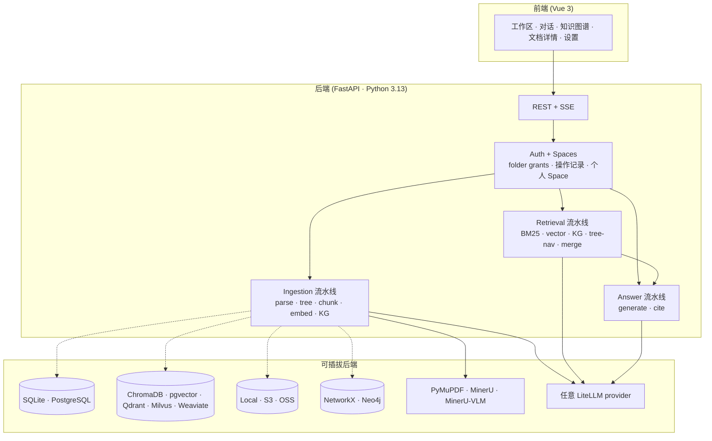

<p align="center">
  
</p>

<h3 align="center">每一句话，都能指回原文。</h3>

<p align="center">
  自托管的文档智能引擎，为不能误引的工作场景而建。每个回答都附**页码 + bbox** 出处 —— 跑在你自己的服务器、你自己的 LLM key、你自己的数据上。
</p>

<p align="center">
  <a href="https://github.com/deeplethe/OpenCraig/releases"></a>
  <a href="LICENSE"></a>
  <a href="https://github.com/deeplethe/OpenCraig/stargazers"></a>
  <a href="https://github.com/deeplethe/OpenCraig/issues"></a>
  <a href="https://discord.gg/XJadJHvxdQ"></a>
</p>

<p align="center">
  <a href="#-快速开始">快速开始</a> ·
  <a href="#-为谁而做">为谁而做</a> ·
  <a href="#-工作原理">原理</a> ·
  <a href="#-基准测试">基准</a> ·
  <a href="docs/">文档</a> ·
  <a href="./README.md">English</a>
</p>

---

## ✨ 为什么

| 你正在用 | 适合什么 | OpenCraig 的不同 |
|---|---|---|
| **ChatGPT / Claude 上传 PDF** | 几个文件的临时问答 | 持久多文档工作区、多用户、含知识图谱、跑在你自己服务器上 |
| **Notion AI / Mendable** | SaaS 优先、不介意上云的小团队 | 语料留在本地；像素级引用；KG 检索；没有 SaaS 订阅 |
| **Glean** | 大企业内部搜索 | Glean 是五位数美金/年起 + 需要企业 admin 团队；OpenCraig 服务一个部门、一个实验室、或一个独立专业人士 |
| **AnythingLLM** | OSS 自托管 RAG | 最接近的同类 —— OpenCraig 在 KG/树检索深度、引用精度、文件夹级多用户授权上更深 |
| **手搓 embedding RAG** | "我们有 Python 团队" | 省掉 6 个月工作：KG 抽取、树检索、引用流水线、多用户 authz、回收站、审计日志、Setup 向导 —— 都已经发布 |

> 对比 **GraphRAG（微软）** —— OpenCraig 把"多跳 KG 检索"这个思路产品化（独立 KG 检索路 + RRF 融合）而不是留在研究 library。树检索受 **PageIndex** 启发，但树**只在入库时建一次**，不在每次查询时重建。

---

## 🎯 为谁而做

OpenCraig 为**不能或不愿把语料放到 SaaS 上的知识密集型小团队**而做：

- **专利代理人 / IP 律所**——长技术 spec、先前技术、引用精度直接是法律资产
- **小律所 / 诉讼组**——委托人特权文档、案例、内部判例库
- **Biotech / 制药 R&D 部门**——HIPAA 邻接合规、文献、内部协议
- **独立分析师 / 卖方研究 / 私募研究台**——招股书、监管文件、alpha 来自跨文档细节
- **大学院系 / 研究中心**——研究生入门、论文库、内部数据集
- **以个体工商户 / 独资工作室名义经营的脑力工作者**——"数据在我自己电脑 / 我自己 VPS 上" 是核心诉求

它**不是**为：客服 bot、公开知识库、营销文案生成、休闲 ChatPDF 而做。

---

## 🧠 工作原理


**两条推理路并行**。BM25 + 向量打 80% 简单 case（字面 + 语义召回）；KG + 树导航处理 20% 难 case —— 多跳问题如 _"苹果的供应商里哪些也供 Samsung？"_，靠 KG 邻域遍历 + LLM 树状结构验证（PageIndex 的思路，但树**只在入库时建一次**，不在每次查询时重建）。

UI 提供完整的 retrieval trace，可看到每条路在每次查询里贡献了什么、被合并/重排丢弃了什么。

---

## 📸 你能得到什么

> **截图：** 见 [`docs/SCREENSHOTS.md`](docs/SCREENSHOTS.md)。

| | |
|---|---|
| **工作区** | 文件管理体验，拖拽、回收站、文件夹 Members 邀请共享。每个用户有自己的个人 Space `/users/<username>`，在 UI 里显示为 `/`；admin 还能看到全局树。每个文件实时显示 ingest 阶段（parsing → embedding → building graph）。 |
| **对话** | 流式回答、`[c_N]` 引用。点引用 → PDF 自动跳到对应 bbox 高亮。引用在追问中保留。 |
| **文档详情** | 三栏：树导航 + PDF 预览 + chunks/KG-mini。chunk 悬停 → 高亮原文区域。 |
| **知识图谱** | Sigma 渲染力导向布局。按文档过滤、搜索实体、点边查支撑 chunk。 |
| **操作记录**（admin） | 每个文件夹 / 文档 / 共享 / 角色变更，附 actor 身份。按用户、操作类别、时间过滤。 |
| **设置向导** | 一键模型平台 preset（SiliconFlow / OpenAI / DeepSeek / Anthropic / Ollama）。新部署 → 浏览器 → 点 tile → 完成。无需改 yaml。 |

---

## 🚀 快速开始

**最快路径**是 docker compose：

```bash
git clone https://github.com/deeplethe/OpenCraig.git
cd OpenCraig
cp .env.example .env  &&  $EDITOR .env       # 设置密码（LLM key 可选——向导会收集）
docker compose up -d                          # postgres + neo4j + opencraig
```

打开 <http://localhost:8000>：

1. **在向导里选模型平台**（国内 / 性价比敏感的部署推荐 SiliconFlow；完全离线推荐 Ollama）
2. **注册**第一个账号——自动 promote 成 admin
3. **拖入一份 PDF**问问题。首次入库要 1 分钟，之后检索是亚秒级

### 裸机安装

```bash
python -m venv .venv && source .venv/bin/activate   # Windows: .venv\Scripts\activate
pip install -r requirements.txt
cd web && npm install && npm run build && cd ..

python scripts/setup.py                              # 命令行向导（web 向导的另一种入口）
python main.py                                        # http://localhost:8000
```

CLI 向导双语（EN / 中文）、可断点续跑（Ctrl+C 后下次接着来），**只装你 yaml 选中的后端依赖**——不用记每种数据库的 pip 名字。

> **建议：** 在 Settings 面板启用 [MinerU](https://github.com/opendatalab/MinerU)，复杂表格 / 公式 / 排版的 PDF 解析质量大幅提升。

---

## 🏗️ 技术栈



每个组件都是 config 切换 —— 在向导里选你的栈，要换就改 `docker/config.yaml`。

---

## ⚙️ 亮点

- **🎯 像素级引用** —— 每个 `[c_N]` 都带 `doc_id + page + bbox`；点击 PDF 直接高亮
- **👥 多用户（不是多租户）** —— 一棵共享树、按文件夹粒度授权。每个用户有个人 Space；admin 管理全局。Path-as-authz 贯穿每次检索调用
- **🪪 文件夹 Members UI** —— 右键文件夹 → 按邮箱邀请同事、设置 view/edit 权限、看到来自父级的继承成员
- **📜 操作记录** —— 每次文件夹 / 文档 / 共享 / 角色变更出现在 `/settings/audit`，含 actor + 过滤 + 分页
- **🔌 一键模型平台** —— SiliconFlow / OpenAI / DeepSeek / Anthropic / Ollama 这些 preset 在首次启动向导里。一个 API key → 拿到 chat + embedding + reranker
- **🛤️ 完整检索 trace** —— 每条路评了什么分、扩了什么、被重排丢了什么
- **🧱 树感知切块** —— chunk 边界尊重文档结构（章节、表格 / 图独占 chunk）
- **🌐 知识图谱含 embedding** —— 实体名 embedding 做跨语言模糊匹配；关系描述 embedding 做关系语义检索
- **🔁 RRF 融合** —— Reciprocal Rank Fusion 合并 4 条路；rerank 前 sibling/descendant/cross-ref 扩展
- **🗑️ 回收站 + 撤销** —— 软删除、Windows 式还原（自动重建被删的父级文件夹）、30 天自动清理
- **⚡ SQLite 单进程 · PG 多进程** —— 启动时自检防误用、worker 数量自动 clamp
- **🌍 多格式** —— PDF / DOCX / PPTX / HTML / Markdown / TXT，加上图片（PNG/JPG/WEBP/GIF/BMP/TIFF）和电子表格（XLSX/CSV/TSV）作为原生"一页一 block"的文档
- **🔒 零回报** —— 无 telemetry、无 analytics、无错误上报回 OpenCraig 自身。详见 [`PRIVACY.md`](PRIVACY.md)

---

## 📊 基准测试

[UltraDomain](https://github.com/HKUDS/LightRAG) 方法论 · LLM-as-judge 两两对比 · 胜率为 **OpenCraig / LightRAG**：

| 领域 | Comprehensiveness | Diversity | Empowerment | **总分** |
|---|:---:|:---:|:---:|:---:|
| Agriculture | **58.6** / 41.4 | 47.1 / **52.9** | **52.9** / 47.1 | **56.4** / 43.6 |
| Computer Science | **55.6** / 44.4 | 48.4 / **51.6** | **54.0** / 46.0 | **54.8** / 45.2 |
| Legal | **57.0** / 43.0 | 46.5 / **53.5** | **53.5** / 46.5 | **55.6** / 44.4 |
| Mix | **56.3** / 43.7 | 47.8 / **52.2** | **54.3** / 45.7 | **55.1** / 44.9 |

<sub>裁判：qwen3-max · 复现：[`scripts/compare_bench.py`](scripts/compare_bench.py) · OpenCraig 还另外提供基准没考核的可验证 `[c_N]` 引用。</sub>

🚧 _更多基准（vs RAGFlow、GraphRAG、vanilla RAG，更多领域）正在做。_

---

## 🗂️ 项目布局

```
OpenCraig/
├── api/                 FastAPI 路由、auth 中间件、设置向导
│   ├── auth/             AuthMiddleware, PathRemap, FolderShareService
│   ├── routes/           每个资源一个文件
│   └── setup_presets.py  SiliconFlow / OpenAI / Ollama / ... 预设
├── answering/           答复 + 引用流水线
├── ingestion/           Parse → tree → chunk → embed → KG
├── parser/              PDF 解析、切块、建树
├── retrieval/           BM25 / vector / KG / tree-nav / RRF 合并
├── embedder/            Embedding 后端（LiteLLM、sentence-transformers）
├── graph/               KG 存储（NetworkX、Neo4j）
├── persistence/         关系 + 向量 + blob + folder service + share service
├── config/              Pydantic 配置模型、YAML 加载器（含 overlay 合并）
├── web/src/             Vue 3 前端（工作区、对话、KG、设置、Setup 向导）
├── docs/operations/     备份 / 恢复 / 升级 runbook
├── docs/roadmaps/       在飞功能设计文档（per-user spaces 等）
└── scripts/             backup.sh、restore.sh、setup.py、batch_ingest.py
```

---

## 📚 文档

- **[Getting Started](docs/getting-started.md)** —— 安装、第一次入库、第一次查询
- **[架构](docs/architecture.md)** —— 完整 ingestion + retrieval + answering 流程图
- **[配置](docs/configuration.md)** —— 每个 YAML 字段及默认值
- **[API 参考](docs/api-reference.md)** —— REST + SSE 流式
- **[部署](docs/deployment.md)** —— Docker、生产 checklist、Nginx
- **[备份与恢复](docs/operations/backup.md)** —— RTO/RPO、调度、跨版本恢复
- **[升级](docs/operations/upgrading.md)** —— alembic 流程、版本锁定、回滚
- **[Auth](docs/auth.md)** —— 多用户、文件夹授权、OAuth-proxy 模式
- **[隐私声明](PRIVACY.md)** —— 哪些数据离开你的网络（剧透：只有你配置的 LLM API 调用）
- **[Roadmaps](docs/roadmaps/)** —— 在飞功能设计文档

---

## 🗺️ 路线图

### 已发布

- [x] **像素级引用** —— `doc_id + page + bbox` 贯穿每个论断
- [x] **树检索** + **KG 检索** + **RRF 融合**
- [x] **多用户、文件夹授权、个人 Space**（path-as-authz，不是多租户）
- [x] **文件夹 Members UI** —— 邀请同事、设置 view/edit 权限
- [x] **操作记录** —— admin 可见的活动 feed
- [x] **首次启动设置向导** —— 一键模型平台 preset
- [x] **一键 docker compose** —— postgres + neo4j + opencraig 含 healthcheck
- [x] **备份 + 恢复脚本**含跨版本恢复说明
- [x] **AGPL v3 + 商业双 license**

### 下一步

- [ ] **Group / Team 抽象** —— 邀请组而不是单用户；按第一个大客户的组织架构按需做
- [ ] **SCIM provisioning** —— Okta / Azure AD 自动同步（企业版）
- [ ] **Web 搜索** —— Tavily / Brave / Bing 通过 `/search?include=["web"]`。Untrusted-content + prompt-injection 防御在这一层落地，后面所有层继承
- [ ] **Agentic search** —— LLM tool call 驱动的多步检索（`search_local` / `web_search` / `fetch_url` / `read_chunk`）
- [ ] **Deep research with HITL** —— Plan → 并行 per-section AS → draft → 综合。三种 HITL 模式
- [ ] **Retrieval MCP** —— `search / query / agentic_search / research_*` 暴露成 MCP tools
- [ ] **完整基准套件** vs RAGFlow / GraphRAG / vanilla 跨更多领域

### 基础工作（并行进行）

- [ ] 扩展到 100 万+文档 —— 增量索引、异步 KG、分片向量库
- [ ] Python SDK（`pip install opencraig-sdk`）
- [ ] 更多连接器 ——飞书 / 企业微信 / 钉钉 / SharePoint / Google Drive 入库

---

## 📈 Star history

<a href="https://star-history.com/#deeplethe/OpenCraig&Date">
  <picture>
    <source media="(prefers-color-scheme: dark)" srcset="https://api.star-history.com/svg?repos=deeplethe/OpenCraig&type=Date&theme=dark" />
    
  </picture>
</a>

---

## 🤝 贡献

欢迎 bug、功能、文档改进。见 [CONTRIBUTING.md](CONTRIBUTING.md)。可以来 [Discord](https://discord.gg/XJadJHvxdQ) 聊设计。

PR 需要签 [CLA](RELICENSING.md#future-contributions)，让项目保留发商业 license 的权利。核心保持 AGPLv3 不变。

## 🔗 相关工作

- [LightRAG](https://github.com/HKUDS/LightRAG) —— 双层图检索的 graph-based RAG
- [GraphRAG](https://github.com/microsoft/graphrag) —— 微软的 graph-powered RAG，含 community summary
- [PageIndex](https://github.com/VectifyAI/PageIndex) —— 基于推理的无向量检索
- [MinerU](https://github.com/opendatalab/MinerU) —— OpenCraig 用的高质量文档解析引擎
- [AnythingLLM](https://github.com/Mintplex-Labs/anything-llm) —— 自托管 RAG 空间最接近的 OSS 商业对手

## License

OpenCraig 采用 [GNU Affero 通用公共许可证 v3.0](LICENSE)（AGPLv3）发布，
适用于社区使用和自部署。

**商业许可**：如果你的组织需要在不受 AGPLv3 约束下使用 OpenCraig
（例如嵌入到闭源产品中，或运行闭源的托管服务），可联系
[info@deeplethe.com](mailto:info@deeplethe.com) 取得商业许可。

> AGPL 切换之前发布的版本仍按 MIT License 授权，那些版本对应的授权
> 永久有效。原始 MIT 文本保留在 [`LICENSE.MIT-historical`](LICENSE.MIT-historical)。
> 详情见 [`RELICENSING.md`](RELICENSING.md)。
