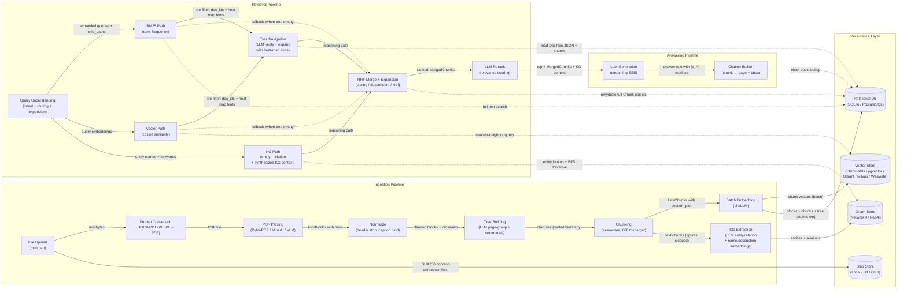
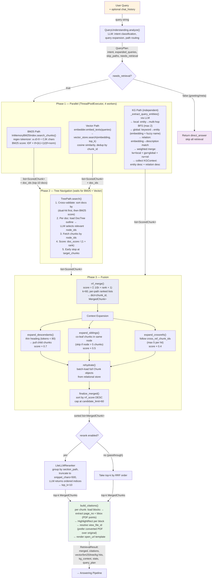
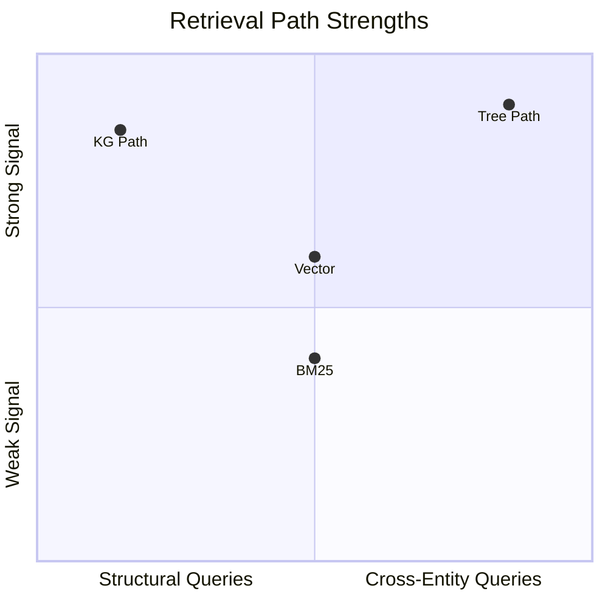
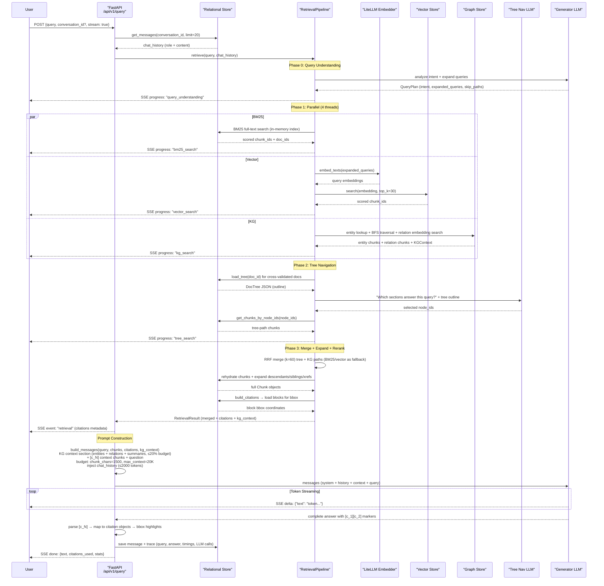
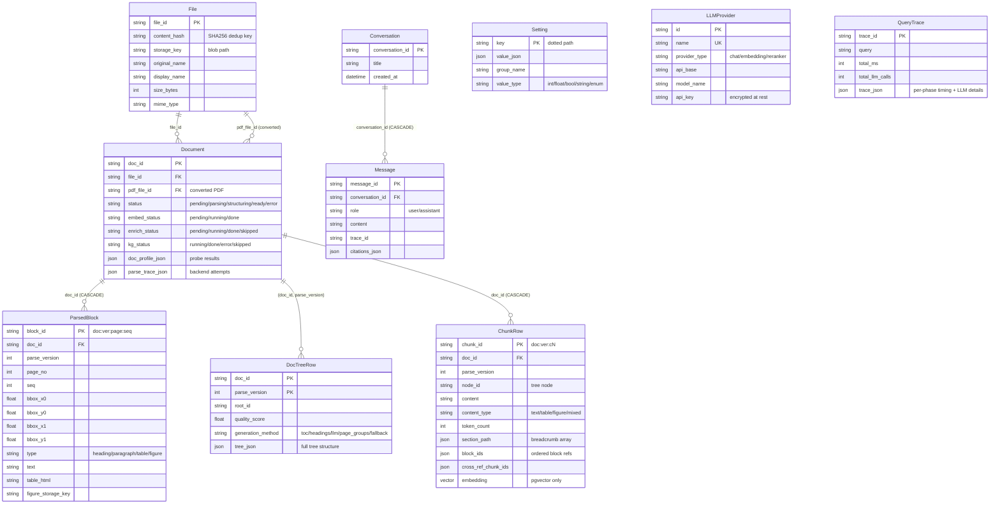
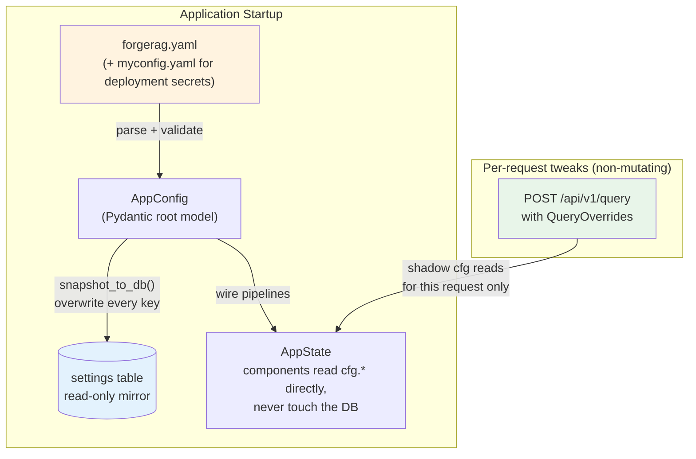

# Architecture Overview

ForgeRAG is built around three core pipelines — **Ingestion**, **Retrieval**, and **Answering** — connected through a unified persistence layer. This document explains how each pipeline works and how they fit together.

## Design Philosophy

1. **Structure-aware processing** — Documents have hierarchy (chapters, sections, subsections). ForgeRAG preserves and leverages this structure throughout the pipeline, from parsing to retrieval.

2. **Dual-reasoning retrieval** — BM25 and vector search provide fast pre-filtering; LLM tree navigation and knowledge graph inference perform deep reasoning on the pre-filtered results. Results are fused via Reciprocal Rank Fusion.

3. **Full customizability** — Every pipeline stage, every retrieval path, every LLM call is independently configurable via YAML. Per-request retrieval overrides (`QueryOverrides` on `/api/v1/query`) let callers toggle paths or bump top-ks without mutating global config — convenient for A/B and SDK clients.

## System Overview



## Project Structure

```
ForgeRAG/
├── api/                  # FastAPI routes, schemas, state management
│   ├── app.py            # Application factory with lifespan
│   ├── state.py          # AppState singleton (holds all pipelines)
│   ├── deps.py           # FastAPI dependency injection
│   ├── schemas.py        # Pydantic request/response models
│   └── routes/           # Route modules by domain
├── answering/            # Answer generation
│   ├���─ pipeline.py       # AnsweringPipeline (sync + streaming)
│   ├── generator.py      # LLM abstraction (LiteLLM backend)
│   ├── prompts.py        # System/user prompt construction
│   └── types.py          # Answer dataclass
├── config/               # Configuration system
│   ├── app.py            # AppConfig root model
│   ├── loader.py         # YAML loading + auto-generation
│   ├── settings_manager.py # DB-backed runtime overrides
│   ├── auth.py           # Credential resolution (api_key_env)
│   ├── parser.py         # Parser/chunker/tree config
│   ├── retrieval.py      # Retrieval config (BM25, vector, tree, merge, rerank)
│   ├── answering.py      # Generator config
│   ├── embedder.py       # Embedder config
│   └── persistence.py    # Database/vector/storage config
├── embedder/             # Embedding layer
│   ├── base.py           # Embedder abstract class
│   ├── litellm.py        # LiteLLM wrapper (OpenAI, Cohere, etc.)
│   ├── sentence_transformers.py  # Local models
│   ├── cached.py         # Disk-cached embedder wrapper
│   └── backfill.py       # Re-embed on model change
├── graph/                # Knowledge graph
│   ├── base.py           # GraphStore abstract + Entity/Relation
│   ├── networkx_store.py # In-memory NetworkX (dev/small scale)
│   └── neo4j_store.py    # Neo4j (production scale)
├── ingestion/            # Document processing
│   ├── pipeline.py       # Two-phase orchestration (upload → ingest)
│   ├── queue.py          # Background worker queue
│   ├── converter.py      # DOCX/PPTX/XLSX/HTML/MD → PDF
│   └── kg_extractor.py   # LLM-based entity/relation extraction
├���─ parser/               # Document parsing
│   ├── pipeline.py       # ParserPipeline (probe → route → parse)
│   ├── probe.py          # Layer-0 document analysis
│   ├── router.py         # Backend selection + fallback chain
│   ├── normalizer.py     # Header/footer removal, caption binding
│   ├── tree_builder.py   # Hierarchical structure inference
│   ├── chunker.py        # Tree-aware chunk generation
│   ├── blob_store.py     # Figure/image blob management
│   ├── schema.py         # Block, Chunk, DocTree, Citation models
│   └─��� backends/         # Parser backends (PyMuPDF, MinerU, etc.)
├── persistence/          # Data layer
│   ├── engine.py         # SQLAlchemy connection management
│   ├── models.py         # ORM models (File, Document, Block, etc.)
│   ├── store.py          # Relational store abstraction
│   ├── ingestion_writer.py # Atomic write for parse results
│   ├── files.py          # Content-addressed file store
│   ├── serde.py          # Row ↔ dataclass serialization
│   └── vector/           # Vector store backends
│       ├── base.py       # VectorStore abstract class
│       ├── chroma.py     # ChromaDB backend
│       ├── pgvector.py   # pgvector (PostgreSQL) backend
│       ├── qdrant.py     # Qdrant backend
│       ├── milvus.py     # Milvus backend
│       └── weaviate.py   # Weaviate backend
├── retrieval/            # Query processing
│   ├── pipeline.py       # Multi-path retrieval orchestration
│   ├── bm25.py           # Pure-Python BM25 index (disk-persistent)
│   ├── vector_path.py    # Embedding similarity search
│   ├── tree_path.py      # Tree navigation protocol
│   ├── tree_navigator.py # LLM-guided tree traversal
│   ├── kg_path.py        # Knowledge graph retrieval
│   ├── query_understanding.py # Intent + routing + expansion
│   ├── merge.py          # RRF fusion + expansion strategies
│   ├── rerank.py         # LLM-based relevance reranking
│   ├── citations.py      # Bbox citation builder
│   ├── trace.py          # Retrieval observability
│   └── types.py          # ScoredChunk, MergedChunk, RetrievalResult
├── web/                  # Vue 3 frontend
├── docker/               # Docker config templates
├── main.py               # Entry point
└── forgerag.yaml         # Local config (git-ignored)
```

---

## Ingestion Pipeline

The ingestion pipeline transforms raw documents into searchable, structured data. It operates in two phases: a fast synchronous upload, followed by background processing.

> **Crash recovery:** On startup, ForgeRAG automatically detects documents stuck in intermediate states (`processing`, `parsing`, `structuring`, etc.) from a previous crash or restart, resets them to `pending`, and re-queues them for ingestion. No manual intervention needed — works across both SQLite and PostgreSQL backends.

```mermaid
flowchart TB
    A["POST /api/v1/documents<br/>(multipart/form-data)"]
    A -->|"raw file bytes"| B["FileStore.store()<br/>SHA256 hash → content-addressed blob"]
    B -->|"file_id + storage_key"| B2["Create Document row<br/>status = pending"]
    B2 -->|"IngestionJob(file_id, doc_id)"| Q["IngestionQueue.submit()<br/>background daemon thread"]

    Q -->|"worker thread pulls job"| C{"needs_conversion?<br/>check file extension"}
    C -->|"DOCX/PPTX/XLSX<br/>HTML/MD/TXT"| D["converter.convert_to_pdf()<br/>python-docx / python-pptx / openpyxl<br/>+ fpdf2 (CJK font support)"]
    C -->|"PDF (native)"| E["Phase 1: Probe"]
    D -->|"converted PDF<br/>+ store as pdf_file_id"| E

    E["probe()<br/>sample ≤50 pages:<br/>text_density, scanned_ratio,<br/>table_density, heading_strength,<br/>multicolumn detection"]
    E -->|"DocProfile<br/>(complexity, needed_tier)"| F

    F["Router.parse()<br/>build backend chain by tier"]

    subgraph BackendChain ["Backend Fallback Chain"]
        direction TB
        F -->|"tier ≥ needed_tier first"| F1["MinerU (Tier 1)<br/>layout-aware, table/formula OCR"]
        F -->|"always last in chain"| F2["PyMuPDF (Tier 0)<br/>fast, always available"]
        F -->|"if scanned"| F3["VLM (Tier 2)<br/>vision-language model"]
        F1 -->|"quality < min_quality<br/>→ try next backend"| F2
    end

    F1 & F2 & F3 -->|"list&lt;Block&gt;<br/>with page_no, bbox, type,<br/>text, confidence"| G

    G["normalize()"]

    subgraph NormSteps ["Normalization Steps"]
        direction TB
        G --> G1["Strip Headers/Footers<br/>blocks on ≥40% pages at same y-coord"]
        G1 --> G2["Merge Cross-Page Paragraphs<br/>no sentence-end + lowercase continuation"]
        G2 --> G3["Bind Captions<br/>Fig/Table N pattern → caption_of pointer"]
        G3 --> G4["Resolve Cross-References<br/>'see Figure 3' → cross_ref_targets"]
    end

    G4 -->|"cleaned blocks<br/>with cross_ref_targets"| H

    H["TreeBuilder.build()"]

    subgraph TreeStrategy ["Tree Strategy"]
        direction TB
        H --> H1{"llm_enabled?"}
        H1 -->|"yes"| H1a["LLM page-group strategy<br/>group pages → LLM infers sections<br/>+ titles + summaries in one call<br/>(TOC/headings passed as hints)"]
        H1 -->|"no"| H1b["Flat fallback<br/>root + single section<br/>(tree_navigable = false)"]
        H1a --> H2["Large-node subdivision<br/>split oversized leaves by position"]
    end

    H1a & H1b & H2 -->|"DocTree<br/>nodes with title, level,<br/>page_start, page_end,<br/>children, block_ids, summary"| I

    I["quality_score()<br/>0.4×coverage + 0.2×balance<br/>+ 0.2×depth + 0.2×density"]
    I -->|"scored DocTree"| J

    J{"do_summary?"}
    J -->|"yes"| J1["_enrich_images()<br/>VLM generates figure descriptions"]
    J1 --> J2["_enrich_summaries()<br/>LLM summarizes tree nodes<br/>(parallel, max_workers=4)"]
    J2 --> K
    J -->|"no"| K

    K["Chunker.chunk()<br/>preorder walk tree"]

    subgraph ChunkLogic ["Chunking Rules"]
        direction TB
        K --> K1["Segment block runs by type<br/>(text / table / figure / formula)"]
        K1 --> K2{"block type?"}
        K2 -->|"table / figure / formula"| K3["Isolate: 1 block = 1 chunk"]
        K2 -->|"text / heading / list"| K4["Greedy pack to target_tokens=600<br/>hard max=1000, merge trailing<br/>min=100 into previous"]
        K3 & K4 --> K5["Filter noise blocks<br/>regex: pure punctuation/whitespace"]
        K5 --> K6["Fill cross_ref_chunk_ids<br/>block cross_ref_targets → chunk IDs"]
    end

    K6 -->|"list&lt;Chunk&gt; with<br/>content, section_path,<br/>block_ids, cross_refs"| L

    L["IngestionWriter.write()<br/>atomic relational transaction"]
    L -->|"INSERT blocks, tree, chunks<br/>(single DB transaction)"| RDB[("Relational DB")]
    L -->|"embedder.embed_chunks()<br/>batch vectors"| VDB[("Vector Store")]

    L --> M{"kg_extraction<br/>enabled?"}
    M -->|"yes"| N["KGExtractor.extract_batch()<br/>group chunks (8/batch, 12K chars)<br/>parallel LLM extraction"]
    N -->|"list&lt;Entity&gt; + list&lt;Relation&gt;<br/>upsert with source tracking"| GraphDB[("Graph Store")]
    M -->|"no"| Done["status = ready"]
    N --> Done

    style A fill:#e8f5e9
    style Done fill:#e8f5e9
    style VDB fill:#e3f2fd
    style GraphDB fill:#fce4ec
```



### Two-Phase Design

**Phase A — Upload** (fast, synchronous):
1. File is stored in the blob store (content-addressed by SHA256 hash, automatic dedup)
2. A `Document` record is created with `status: pending`
3. Returns immediately with `doc_id` and `file_id`

**Phase B — Ingest** (slow, background queue with configurable workers):

| Step | Description | Output |
|------|-------------|--------|
| **Format Conversion** | DOCX/PPTX/XLSX/HTML/MD/TXT → PDF via pure Python (no external tools) | PDF file |
| **Probe** | Fast analysis: format, page count, text density, scanned ratio, table density | `DocumentProfile` |
| **Parse** | Backend chain by quality: PyMuPDF → MinerU → VLM. Falls through on quality check failure | `list[Block]` |
| **Normalize** | Strip headers/footers, merge cross-page paragraphs, bind figure captions, resolve cross-references | Cleaned blocks |
| **Tree Building** | LLM page-group inference: group pages → LLM infers sections + titles + summaries (TOC/headings passed as hints). Large nodes auto-subdivided. Flat fallback when LLM unavailable. | `DocTree` |
| **Chunking** | Walk tree preorder, pack blocks into chunks (target 600 tokens, max 1000). Tables/figures/formulas isolated. Noise blocks filtered | `list[Chunk]` |
| **Persist** | Atomic write: blocks, chunks, tree to relational DB | DB rows |
| **Embed** | Batch-embed chunk texts → vector store; BM25 index updated | Vectors |
| **KG Extraction** | LLM extracts entities + relations from text chunks (figures skipped). Parallel batch processing | Graph data |

### Data Model

**Block** — the smallest addressable unit:
- `block_id` format: `{doc_id}:{parse_version}:{page_no}:{seq}`
- `page_no`, `bbox` (x0, y0, x1, y1 in PDF points)
- `type`: heading, paragraph, table, figure, formula, caption, list, header, footer
- `text`, `confidence`, optional `table_html`, `figure_storage_key`, `formula_latex`

**Chunk** — semantically coherent retrieval unit:
- `chunk_id` format: `{doc_id}:{parse_version}:c{seq}`
- `node_id` (tree node it belongs to), `block_ids` (ordered list)
- `content`, `content_type` (text, table, figure, mixed)
- `token_count`, `section_path` (e.g., `["Chapter 1", "1.2 Methods"]`)
- `ancestor_node_ids`, `cross_ref_chunk_ids`

**DocTree** — hierarchical structure:
- Rooted tree of `TreeNode`s with `title`, `level`, `page_start`, `page_end`, `children`, `block_ids`
- `generation_method`: toc, headings, llm, page_groups, fallback
- `quality_score`: 0–1 confidence metric

---

## Retrieval Pipeline

The retrieval pipeline uses **multi-path fusion** — running multiple retrieval strategies and merging results for robust recall. Every path is independently configurable.



### Execution Order

| Phase | What runs | Why |
|-------|-----------|-----|
| **Phase 0** | Query Understanding — intent analysis, routing, expansion | Decides which paths to run, generates expanded queries |
| **Phase 1** | BM25 + Vector + KG start in parallel | Independent signals, no dependencies |
| **Phase 2** | Tree Navigation — waits for BM25 + Vector | Uses their scored chunks as heat-map hints annotated on tree outlines; LLM verifies relevance + discovers adjacent sections |
| **Phase 3** | RRF Merge → Expansion → Rerank → Citations | KG results also merged in; final ranking and context assembly |

### Path Details

**BM25 Path** — Pure-Python BM25 index with disk persistence. Supports CJK tokenization. Configurable: `k1`, `b`, `top_k`.

**Vector Path** — Embeds query → cosine similarity search in ChromaDB or pgvector. Configurable: model, `top_k`, metadata filters.

**Tree Path (PageIndex-inspired)** — Sends a compact **tree outline** (titles, node IDs, page ranges) to the LLM. The LLM reasons step-by-step about which sections are relevant:

> *"Query: What was the EBITDA margin trend?*
> *Thinking: EBITDA relates to operating income. The MD&A section (n5, p35–45) would discuss trends.*
> *node_list: [n5, n2]"*

Key design: runs after BM25 + Vector to scope documents; single LLM call per document; parallel across documents with early stopping.

**KG Path (LightRAG-inspired)** — Three-level knowledge graph retrieval:
- **Local:** Extract entities from query → resolve to graph nodes (SHA256 exact → name-embedding cosine → fuzzy name, first hit wins) → multi-hop traversal (max 2 hops, decaying score)
- **Global:** Keyword search over entity names (embedding-first, fuzzy name fallback) → score by rank
- **Relation:** Embed query → cosine match over relation description embeddings
- **Fusion:** `final = lw × local + gw × global + rw × relation`

The embedding-first resolution in Local / Global makes KG retrieval **cross-lingual**: a Chinese query "蜜蜂" lands near an English-named entity "bee" as long as the embedder is multilingual (see `search_entities_by_embedding`).

**Synthesized KG Context** — Beyond chunk discovery, the KG path also collects a `KGContext` object containing:
- **Entity descriptions** — consolidated profiles for each matched entity (LLM-synthesized when fragments accumulate beyond threshold)
- **Relation descriptions** — semantic summaries of how entities relate

This "distilled knowledge layer" is injected directly into the LLM generation prompt (before raw text chunks), giving the model thematic understanding alongside detailed source passages — inspired by LightRAG's dual-level context assembly (entities + relations + text units). The KG context section is budget-capped at 40% of `max_context_chars` to preserve room for cited text chunks.

**Description Consolidation** — When an entity is mentioned across many chunks (or documents), its description accumulates fragments via newline-joined concatenation in the graph store. The ingest pipeline runs a post-upsert *summarise phase* (`graph.summarize.summarize_descriptions`, adapted from LightRAG's `_handle_entity_relation_summary`) that compacts the cumulative fragment list into one canonical paragraph when token total ≥ `summary.trigger_tokens` (default 1200) or fragment count ≥ `summary.force_on_count` (default 8). Map-reduce + recursion handle entities so popular their fragment list exceeds the LLM context window in one shot. Re-embeds relation descriptions after compaction so vector search stays consistent with the canonical text.

### Tree + KG: Complementary Reasoning



| Query type | Tree path | KG path |
|------------|-----------|---------|
| *"Item 7 MD&A analysis"* | Excels — navigates standardized structure directly | Scattered entity mentions |
| *"Apple's relationship with Foxconn"* | No structural hint | Finds entity relations directly |
| *"EBITDA margins in Q3"* | Finds Financial Statements section | Finds entity → source chunks |
| *"CEO compensation"* | May miss if no dedicated section | Finds entity → relation → chunks |

### Merge Strategy

**Reciprocal Rank Fusion (RRF):** `score = 1 / (k + rank)` with k=60. Normalizes across paths with different score distributions.

**Expansion strategies** (each independently configurable):

| Strategy | What it does | Score discount |
|----------|-------------|----------------|
| **Descendant** | Thin heading chunk → pull in child chunks | 0.7× |
| **Sibling** | Add adjacent chunks from the same tree node | 0.5× |
| **Cross-reference** | Follow "see Table 3" references to target chunks | 0.4× |

---

## Answering Pipeline



### Streaming (SSE)

The `ask_stream()` method uses Server-Sent Events to stream results progressively:

1. `progress` events — query understanding, vector search, tree search status with elapsed times
2. `retrieval` event — merged chunks and citations metadata
3. `delta` events — text tokens as they're generated
4. `done` event — final answer with all citations

### Citations

Each citation carries:
- `chunk_id` — which chunk it references
- `block_ids` — specific blocks within the chunk
- `page_no` — PDF page number
- `bbox` — bounding box coordinates (x0, y0, x1, y1) in PDF points
- `snippet` — relevant text excerpt
- `file_id` — for the PDF viewer to render highlights

---

## Persistence Layer

```mermaid
flowchart TB
    subgraph AppState ["AppState (api/state.py)"]
        direction TB
        Pipeline["IngestionPipeline"]
        RetPipe["RetrievalPipeline"]
        AnsPipe["AnsweringPipeline"]
    end

    subgraph Relational ["Relational Store (persistence/store.py)"]
        direction TB
        Engine["SQLAlchemy 2.0 Engine<br/>make_engine(cfg)"]
        Engine --> PG["PostgreSQL<br/>(production default)<br/>psycopg driver, pooled"]
        Engine --> SQLite["SQLite<br/>(dev / demo / tests)<br/>WAL mode, busy_timeout"]

        Tables["Tables:<br/>File, Document, ParsedBlock,<br/>DocTreeRow, ChunkRow,<br/>Conversation, Message,<br/>Setting, QueryTrace"]
    end

    subgraph Vector ["Vector Store (persistence/vector/)"]
        direction TB
        VecBase["VectorStore Protocol<br/>upsert / search / delete"]
        VecBase --> Chroma["ChromaDB<br/>persistent or HTTP mode"]
        VecBase --> PGV["pgvector<br/>in-database, HNSW/IVFFlat"]
        VecBase --> Qdr["Qdrant<br/>standalone, gRPC/HTTP"]
        VecBase --> Mil["Milvus<br/>scalable, HNSW/IVF"]
        VecBase --> Weav["Weaviate<br/>multi-modal, GraphQL"]
    end

    subgraph BlobSt ["Blob Store (parser/blob_store.py)"]
        direction TB
        BlobBase["BlobStore Protocol<br/>put / get / url_for"]
        BlobBase --> Local["Local FS<br/>atomic write (tmp + rename)<br/>2-level hash sharding"]
        BlobBase --> S3["Amazon S3<br/>boto3, presigned URLs"]
        BlobBase --> OSS["Alibaba OSS<br/>oss2, signed URLs"]
    end

    subgraph GraphSt ["Graph Store (graph/)"]
        direction TB
        GraphBase["GraphStore Protocol<br/>upsert_entity / search / traverse"]
        GraphBase --> NX["NetworkX<br/>in-memory DiGraph<br/>JSON file persistence<br/>FAISS vector indexes"]
        GraphBase --> Neo["Neo4j<br/>Cypher queries<br/>full-text index on name<br/>unique constraint on entity_id"]
    end

    Pipeline -->|"atomic write:<br/>blocks + tree + chunks"| Relational
    Pipeline -->|"embed_chunks() → upsert()"| Vector
    Pipeline -->|"SHA256 blob storage"| BlobSt
    Pipeline -->|"upsert_entity/relation()"| GraphSt

    RetPipe -->|"BM25: full-text search<br/>Tree: load_tree + get_chunks<br/>Merge: rehydrate chunks<br/>Cite: load block bbox"| Relational
    RetPipe -->|"cosine nearest-neighbor"| Vector
    RetPipe -->|"entity lookup + BFS"| GraphSt

    AnsPipe -->|"load chat history<br/>save turn + trace"| Relational
```



### Data Model (persistence/models.py)



### Valid Backend Combinations

| Relational | Vector | Notes |
|------------|--------|-------|
| PostgreSQL | pgvector | Single DB, recommended for production |
| PostgreSQL | ChromaDB | Works, separate vector DB |
| Any | Qdrant | Production-grade, rich filtering, gRPC |
| Any | Milvus | Scalable, GPU-accelerated |
| Any | Weaviate | Multi-modal, GraphQL API |
| SQLite | ChromaDB | First-class option (warns on `--workers >1`); use Postgres for multi-worker production |

---

## Configuration System

**YAML is the single source of truth.** The DB holds a one-way mirror (`settings` table) written at startup so admin tools can read a snapshot of the effective config, but the runtime never reads it back. v0.2.0 dropped the `provider_id` indirection: model + api_key + api_base are now inlined directly under each subsystem in yaml.



**To change configuration**: edit yaml, restart the backend. This applies to every setting — infrastructure, LLM providers, retrieval knobs, prompts, all of it.

**Per-request overrides**: `QueryOverrides` on the `/query` request body can toggle retrieval paths, bump top-ks, swap rerank on/off etc. for a single query. These never mutate the global cfg. See [api-reference.md](api-reference.md#post-apiv1query) for the field list.

## Web UI

The frontend (Vue 3 + TailwindCSS) provides these pages:

| Page | Description |
|------|-------------|
| **Chat** | Q&A interface with streaming progress, inline citations, PDF viewer with bbox highlights, trace inspection |
| **Workspace** | Folder-centric file manager (tree sidebar + grid/list view) — upload, rename, move, trash/restore (Windows-style with auto-rebuild of missing parents) |
| **Document Detail** | Three-pane: tree navigator + PDF viewer + chunks/KG mini panel. Hover a chunk to see its source bbox |
| **Knowledge Graph** | Visual graph exploration with Sigma.js — entities, relations, subgraph queries |

See [Configuration Reference](configuration.md) for all available options.
